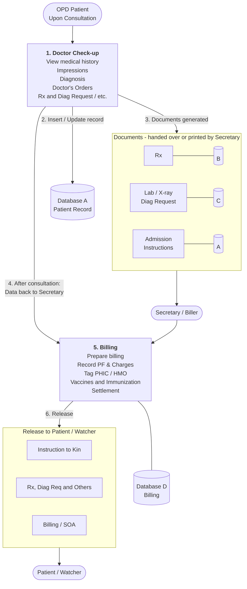

# OPD Consultation Workflow Plan

This document describes the outpatient (OPD) consultation workflow, from the moment a patient is consulted to the release of prescriptions, requests, and billing to the patient or watcher.

## Actors

| Actor | Role |
|-------|------|
| **OPD Patient** | Person who comes in for consultation |
| **Doctor** | Conducts the check-up, records findings, and issues orders |
| **Secretary / Biller** | Prints documents, prepares billing, and handles settlement |
| **Patient / Watcher** | Receives the final instructions, requests, and billing |

## Data Stores

| Label | Used For (as shown in the diagram) |
|-------|-------------------------------------|
| **A** | Patient record (inserted/updated by the doctor); also linked to Admission Instructions |
| **B** | Rx (prescriptions) |
| **C** | Lab / X-ray diagnostic requests |
| **D** | Billing and settlement records |

## Workflow Diagram

## Step-by-Step Process

### Start: Upon Consultation
The OPD patient arrives and is consulted.

### Step 1: Doctor Check-up
The doctor performs the check-up and does the following:

- View medical history
- Record impressions
- Make the diagnosis
- Give doctor's orders
- Issue Rx and diagnostic requests, and other items as needed

### Step 2: Insert / Update Record
The doctor's findings and orders are saved by inserting or updating the patient's record in **Database A**.

### Step 3: Generate Documents
The outputs of the check-up are prepared as documents. They are either handed over directly or printed by the Secretary:

| Document | Data Store |
|----------|-----------|
| Rx (prescription) | B |
| Lab / X-ray Diagnostic Request | C |
| Admission Instructions | A |

These documents are passed on to the **Secretary / Biller**.

### Step 4: Data Back to Secretary
After the consultation, the consultation data is sent back to the Secretary so that billing can proceed.

### Step 5: Billing (Secretary / Biller)
The Secretary / Biller performs the following, with records kept in **Database D**:

- Prepare billing
- Record PF (professional fee) and charges
- Tag PHIC / HMO coverage
- Record vaccines and immunizations
- Process settlement

### Step 6: Release to Patient / Watcher
The following are released to the patient or watcher:

- **Instruction to Kin**
- **Rx, Diag Req and Others**
- **Billing / SOA** (Statement of Account)

## Abbreviations

| Term | Meaning |
|------|---------|
| OPD | Outpatient Department |
| Rx | Prescription |
| Diag | Diagnostic |
| PF | Professional Fee |
| PHIC | Philippine Health Insurance Corporation (PhilHealth) |
| HMO | Health Maintenance Organization |
| Immu | Immunization |
| SOA | Statement of Account |

## Notes

- The diagram's "View m.histon" step is interpreted here as "View medical history".
- Database A appears twice in the diagram: once for the patient record (Step 2) and once beside Admission Instructions (Step 3). The contents of each data store are inferred from their position in the diagram.