# Implementation Plan: Admin Management Routes & PSGC `lib_` Address Integration

This implementation plan details the architecture, UI design, backend controllers, database queries, and testing strategies to fix and complete the **5 Admin Management Page Routes** and integrate Philippine Standard Geographic Code (PSGC) **`lib_` address tables** into User Management, Patient Masterlist, and Company Profile.

---

## 1. Goal Description

The objective is twofold:
1. **Admin Management Page Routes Completion**:
   Fully develop and enhance the 5 admin management pages:
   - [`/admin/consultations/billing`](file:///C:/docker/php_projects/kayakapmd_clinic/resources/views/pages/admin/consultations/billing.blade.php) (Patient Consultation Charges & POS Billing)
   - [`/admin/consultations/settlements`](file:///C:/docker/php_projects/kayakapmd_clinic/resources/views/pages/admin/consultations/settlements.blade.php) (Payment & Settlements / SOA)
   - [`/admin/hmo`](file:///C:/docker/php_projects/kayakapmd_clinic/resources/views/pages/admin/hmo.blade.php) (HMO Masterlist Management)
   - [`/admin/utilities/chargecat`](file:///C:/docker/php_projects/kayakapmd_clinic/resources/views/pages/admin/utilities/chargecat.blade.php) (Charges Categories)
   - [`/admin/utilities/diagcat`](file:///C:/docker/php_projects/kayakapmd_clinic/resources/views/pages/admin/utilities/diagcat.blade.php) (Diagnostic Categories)

   **Key Page Requirements**:
   - **Column Filters with Ordering**: Every table column header (`<th>`) features a dropdown modal/menu containing sorting (Ascending / Descending / Reset) and column-specific filtering (distinct picklists for categorical columns like HMO Type, Payment Type, Category, and text search for text/code columns).
   - **CRUD Operations**: Complete Add, Edit, and Delete modals/forms mapped directly to their schema fields.
   - **Loaders & Confirmations**: Asynchronous button loading spinners, table redraw indicators (`processing: true`), SweetAlert2 confirmation dialogs before deletions, and responsive toast feedback.

2. **PSGC `lib_` Geographic Address Integration**:
   Integrate the authoritative PSGC tables (`lib_region`, `lib_province`, `lib_municipality`, `lib_barangay`, `lib_zipcode`) documented in [`.gemini/database/kayakapmdv2_data_dictionary.md`](file:///C:/docker/php_projects/kayakapmd_clinic/.gemini/database/kayakapmdv2_data_dictionary.md) into all address inputs:
   - **Patient Masterlist**: Add Patient (`add_patient.blade.php`) & Edit Patient (`edit_patient.blade.php`) saving directly into `pxmasterlist` columns (`region`, `province`, `muncity`, `brgy`, `streetadrs`, `zipcode`, `address`).
   - **User Management**: Add & Edit Secretary (`secretaries.blade.php`, `edit_secretary.blade.php`) and Add & Edit Doctor (`add_doctor.blade.php`, `edit_doctor.blade.php`), compiling composite formatted addresses into `secadrs` and `adrs`.
   - **Admin Profile**: Company Address (`profile.blade.php`, `profile.js`) binding `#phregion`, `#phprov`, `#phmun`, `#phbrgy`, `#phzipcode`.

---

## 2. User Review Required

> [!IMPORTANT]
> **Performance Optimization on `lib_barangay`**: The database contains **91,936 barangays** across 1,769 municipalities. Loading all barangays in a single upfront API payload causes severe network latency and browser freezes. We implement **on-demand cascading AJAX endpoints** (`/api/address/regions`, `/api/address/provinces`, `/api/address/municipalities`, `/api/address/barangays`, `/api/address/zipcode`), ensuring every dropdown query runs in under **10ms**.

> [!NOTE]
> **HMO Backend Completion**: `routes/api.php` already contains routes for `fetch_all_hmo`, `add_hmo`, `edit_hmo`, and `delete_hmo`, but their controller methods were missing from [`app/Http/Controllers/ManagementController.php`](file:///C:/docker/php_projects/kayakapmd_clinic/app/Http/Controllers/ManagementController.php). We implement them against [`App\Models\HMOModel`](file:///C:/docker/php_projects/kayakapmd_clinic/app/Models/HMOModel.php) (`hmo_masterlist`).

> [!NOTE]
> **Vite Bundling**: New and updated scripts are registered in [`vite.config.js`](file:///C:/docker/php_projects/kayakapmd_clinic/vite.config.js) and compiled via `npm run build`.

---

## 3. Architecture & Data Flow

```mermaid
flowchart TD
    subgraph UI ["Blade Views & DataTables UI"]
        BC["admin/consultations/billing"]
        SC["admin/consultations/settlements"]
        HMO["admin/hmo"]
        CC["admin/utilities/chargecat"]
        DC["admin/utilities/diagcat"]
        PM["Patient Masterlist Modals"]
        UM["User Management Modals"]
        CP["Admin Profile View"]
    end

    subgraph Helpers ["Reusable Frontend Components"]
        CF["initTableColumnFilters() (Sorting & Filter Dropdowns)"]
        AC["initAddressCascade() (PSGC Cascading Pickers)"]
        BL["Button & Table Loading Spinners"]
    end

    subgraph API ["Laravel API Routes (routes/api.php)"]
        A_HMO["/api/*_hmo"]
        A_BILL["/api/*_billing"]
        A_SETT["/api/*_settlement*"]
        A_CAT["/api/*_charge_category & *_diagnostic_category"]
        A_GEO["/api/address/* (regions, provinces, mun, brgy, zip)"]
    end

    subgraph DB ["MySQL Database Tables (Authoritative Data Dictionary)"]
        T_HMO[("hmo_masterlist")]
        T_BILL[("pxcharges")]
        T_SETT[("pxsettlements")]
        T_CHGCAT[("charges_category")]
        T_DIAGCAT[("diagnostic_category")]
        T_GEO[("lib_region, lib_province, lib_municipality, lib_barangay, lib_zipcode")]
        T_PX[("pxmasterlist")]
        T_USERS[("doctors, secretaryrights, kayakapmd_profile")]
    end

    UI --> Helpers
    Helpers --> API
    API --> DB
```



---

## 4. Proposed Changes

### Component 1: Geographic Reference API & Reusable Address Cascade

#### [NEW] `resources/js/helpers/address-cascade.js`
A reusable client-side module providing cascading dropdown logic across Region, Province, Municipality, Barangay, and Zipcode:
- Fetches `/api/address/regions` on init.
- Listens for region changes to load `/api/address/provinces?pro_code=...`.
- Listens for province changes to load `/api/address/municipalities?pro_code=...&province=...`.
- Listens for municipality changes to load `/api/address/barangays?...` and auto-fills `/api/address/zipcode?...`.
- Compiles the full string: `[Street], Brgy. [Brgy], [City/Mun], [Province] [Zip]`.
- Exposes `setAddressValues({ region, province, muncity, brgy, streetadrs, zipcode, address })` for edit modals.

#### [MODIFY] `app/Http/Controllers/ManagementController.php`
Add dedicated PSGC address endpoints:
```php
public function getRegions()
{
    return response()->json(['regions' => DB::table('lib_region')->select(['REGION_CODE', 'REGION_DESC', 'PRO_CODE'])->orderBy('REGION_CODE')->get()]);
}

public function getProvinces(Request $request)
{
    $proCode = str_pad($request->pro_code, 2, '0', STR_PAD_LEFT);
    return response()->json(['provinces' => DB::table('lib_province')->where('PROCODE', $proCode)->select(['PROCODE', 'PROVINCE', 'PROV_NAME'])->orderBy('PROV_NAME')->get()]);
}

public function getMunicipalities(Request $request)
{
    return response()->json(['municipalities' => DB::table('lib_municipality')->where('PROCODE', $request->pro_code)->where('PROVINCE', $request->province)->select(['PROCODE', 'PROVINCE', 'MUNICIPALITY', 'MUN_NAME'])->orderBy('MUN_NAME')->get()]);
}

public function getBarangays(Request $request)
{
    return response()->json(['barangays' => DB::table('lib_barangay')->where('PROCODE', $request->pro_code)->where('PROVINCE', $request->province)->where('MUNICIPALITY', $request->municipality)->select(['BARANGAY', 'BRGY_NAME'])->orderBy('BRGY_NAME')->get()]);
}

public function getZipcode(Request $request)
{
    $zip = DB::table('lib_zipcode')->where('PROCODE', $request->pro_code)->where('PROVINCE', $request->province)->where('MUNICIPALITY', $request->municipality)->value('ZIP_CODE');
    return response()->json(['zipcode' => $zip]);
}
```

#### [MODIFY] `routes/api.php`
Register the address endpoints:
```php
Route::get('address/regions', [ManagementController::class, 'getRegions']);
Route::get('address/provinces', [ManagementController::class, 'getProvinces']);
Route::get('address/municipalities', [ManagementController::class, 'getMunicipalities']);
Route::get('address/barangays', [ManagementController::class, 'getBarangays']);
Route::get('address/zipcode', [ManagementController::class, 'getZipcode']);
```

---

### Component 2: Address Integration in Patient Masterlist, User Management & Profile

#### [MODIFY] `resources/views/modals/add_patient.blade.php` & `resources/views/modals/edit_patient.blade.php`
- Replace plain text inputs with cascading select elements (`#region`, `#province`, `#muncity`, `#brgy`, `#zipcode`, `#streetadrs`, `#address`).
- In `resources/js/pages/doctor/patients.js` and `resources/js/pages/secretary/queue.js`, bind `initAddressCascade` for both modals and populate current values on modal edit.

#### [MODIFY] `resources/views/pages/admin/users/secretaries.blade.php` & `resources/views/modals/edit_secretary.blade.php`
- Add cascading address select grid for Secretary address.
- Compiles formatted address string into `secadrs` (and hidden fields for individual components).

#### [MODIFY] `resources/views/modals/add_doctor.blade.php` & `resources/views/modals/edit_doctor.blade.php`
- Add cascading address select grid for Doctor address.
- Compiles formatted address string into `adrs`.

#### [MODIFY] `resources/views/pages/admin/profile.blade.php` & `resources/js/pages/admin/profile.js`
- Connect `#phregion`, `#phprov`, `#phmun`, `#phbrgy`, `#phzipcode` to `initAddressCascade`.
- Update `loadCompanyProfile` and `updateProfile` in `ManagementController.php` to read and save `HOSP_ADDREG`, `HOSP_ADDPROV`, `HOSP_ADDMUN`, `HOSP_ADDBRGY`, and `HOSP_ADDZIPCODE`.

---

### Component 3: Reusable Column Filter Dropdown & Ordering Component

#### [NEW] `resources/js/helpers/table-column-filter.js`
Reusable DataTables column filter & sort helper:
```javascript
export function initTableColumnFilters(dataTable, tableSelector) {
    // 1. Sort Ascending / Descending / Reset handlers
    $(tableSelector).find('.btn-sort-asc').on('click', function(e) {
        e.stopPropagation();
        const colIdx = $(this).data('col');
        dataTable.order([colIdx, 'asc']).draw();
        updateSortBadge($(this), 'ASC');
    });
    $(tableSelector).find('.btn-sort-desc').on('click', function(e) {
        e.stopPropagation();
        const colIdx = $(this).data('col');
        dataTable.order([colIdx, 'desc']).draw();
        updateSortBadge($(this), 'DESC');
    });
    $(tableSelector).find('.btn-sort-clear').on('click', function(e) {
        e.stopPropagation();
        dataTable.order([]).draw();
        clearSortBadge($(this));
    });

    // 2. Filter Apply & Clear handlers (text search and categorical picklists)
    $(tableSelector).find('.btn-filter-apply').on('click', function(e) {
        e.stopPropagation();
        const $menu = $(this).closest('.column-filter-menu');
        const colIdx = $menu.data('col');
        const textVal = $menu.find('.col-filter-input').val();
        const selectedChecks = $menu.find('.col-filter-check:checked').map(function() { return $(this).val(); }).get();

        if (selectedChecks.length > 0) {
            const regex = '^(' + selectedChecks.map($.fn.dataTable.util.escapeRegex).join('|') + ')$';
            dataTable.column(colIdx).search(regex, true, false).draw();
        } else if (textVal) {
            dataTable.column(colIdx).search(textVal).draw();
        } else {
            dataTable.column(colIdx).search('').draw();
        }
    });

    $(tableSelector).find('.btn-filter-clear').on('click', function(e) {
        e.stopPropagation();
        const $menu = $(this).closest('.column-filter-menu');
        const colIdx = $menu.data('col');
        $menu.find('.col-filter-input').val('');
        $menu.find('.col-filter-check').prop('checked', false);
        dataTable.column(colIdx).search('').draw();
    });
}
```

---

### Component 4: Admin Utilities — Charges Category (`admin/utilities/chargecat`)

#### [MODIFY] `resources/views/pages/admin/utilities/chargecat.blade.php`
- Build complete responsive layout with Header, "+ Add Charge Category" button, and table.
- Table columns: `Actions`, `Category Ref No`, `Category Name`, `Created Date`.
- Every column header includes the filter dropdown modal with sort and search.
- Includes Add & Edit modal dialogs.

#### [NEW] `resources/js/pages/admin/utilities/chargecat.js`
- Connects to `/api/fetch_charge_categories`, `/api/create_charge_category`, `/api/edit_charge_category`, `/api/delete_charge_category`.
- Implements `setBtnLoading`, SweetAlert2 delete confirmation, and column filters.

---

### Component 5: Admin Utilities — Diagnostic Category (`admin/utilities/diagcat`)

#### [MODIFY] `app/Http/Controllers/ManagementController.php`
Implement missing `editDiagnosticCategory`:
```php
public function editDiagnosticCategory(Request $request)
{
    $catg = DiagnosticsCategoryModel::where('category_refno', $request->category_refno)->first();
    if ($catg) {
        $catg->update(['category_name' => $request->category_name]);
        return response()->json(['success' => true]);
    }
    return response()->json(['success' => false, 'message' => 'Category not found.']);
}
```

#### [MODIFY] `routes/api.php`
Add `Route::post('edit_diagnostic_category', [ManagementController::class, 'editDiagnosticCategory']);`

#### [MODIFY] `resources/views/pages/admin/utilities/diagcat.blade.php`
- Build layout with Header, "+ Add Diagnostic Category" button, table, and modals.
- Table columns: `Actions`, `Category Ref No`, `Category Name`, `Created Date`.
- Headers with column filter dropdown modals.

#### [NEW] `resources/js/pages/admin/utilities/diagcat.js`
- Full DataTables, CRUD logic, button loaders, SweetAlert2 confirmations.

---

### Component 6: Admin HMO Management (`admin/hmo`)

#### [MODIFY] `app/Http/Controllers/ManagementController.php`
Implement full HMO CRUD methods:
- `fetchAllHmo()`: returns `HMOModel::all()`.
- `addHmo(Request $request)`: creates `HMOModel` with `hmocode` (or generated `HMO...`), `hmoname`, `hmotype`, `hmoaddress`, `coacode`, `accre_no`, `dw_clientcode`.
- `editHmo(Request $request)`: updates `HMOModel`.
- `deleteHmo(Request $request)`: deletes from `HMOModel`.

#### [MODIFY] `resources/views/pages/admin/hmo.blade.php`
- Expand table with full columns from `hmo_masterlist`: `Actions`, `HMO Code`, `HMO Name`, `Type` (HMO/Company/Government), `Address`, `COA Code`, `Accreditation No`.
- Column filter dropdown modals with ordering and categorical picklist for Type.
- Add HMO and Edit HMO modal dialogs with all schema fields.

#### [NEW] `resources/js/pages/admin/hmo.js`
- Handles table initialization, column filters, Add/Edit modals with loaders, SweetAlert2 delete confirmations.

---

### Component 7: Admin Consultation Billing (`admin/consultations/billing`)

#### [MODIFY] `app/Http/Controllers/ManagementController.php`
Add Admin Consultation Billing endpoints:
- `fetchAdminBillings(Request $request)`: queries `pxcharges` table with clientcode isolation.
- `addAdminBilling(Request $request)`: creates billing charge in `pxcharges` (with `consultationrefno`, `pxname`, `docname`, `servicename`, `group_category`, `retail`, `quantity`, `total`, `discount`, `net_total`, `payment_type`, `transactiontype`).
- `editAdminBilling(Request $request)`: updates charge in `pxcharges`.
- `deleteAdminBilling(Request $request)`: deletes charge from `pxcharges`.
- `fetchActiveConsultations(Request $request)`: returns active consultations/patients for the searchable dropdown.

#### [MODIFY] `routes/api.php`
Register routes:
- `Route::post('admin/fetch_billings', [ManagementController::class, 'fetchAdminBillings']);`
- `Route::post('admin/add_billing', [ManagementController::class, 'addAdminBilling']);`
- `Route::post('admin/edit_billing', [ManagementController::class, 'editAdminBilling']);`
- `Route::post('admin/delete_billing', [ManagementController::class, 'deleteAdminBilling']);`
- `Route::post('admin/active_consultations', [ManagementController::class, 'fetchActiveConsultations']);`

#### [MODIFY] `resources/views/pages/admin/consultations/billing.blade.php`
- Build full Consultation Billing management console.
- Table columns: `Actions`, `Trans Date`, `Consultation Ref`, `Patient Name`, `Doctor Name`, `Service / Item`, `Category`, `Retail Price`, `Qty`, `Total`, `Discount`, `Net Total`, `Payment Type`, `Transaction Type`.
- Headers include column filter dropdown modals with sort and picklists.
- Add & Edit Billing Item modals with auto-populating patient dropdown.

#### [NEW] `resources/js/pages/admin/consultations/billing.js`
- Handles DataTables, column filters, Add/Edit modal calculations (`quantity * retail - discount = net_total`), button spinners, SweetAlert2 confirmations.

---

### Component 8: Admin Consultation Settlements (`admin/consultations/settlements`)

#### [MODIFY] `app/Http/Controllers/ManagementController.php`
Add Admin Settlements endpoints:
- `fetchAdminSettlements(Request $request)`: queries `pxsettlements` (`SettlementsModel`).
- `addAdminSettlement(Request $request)`: creates settlement in `pxsettlements`.
- `editAdminSettlement(Request $request)`: updates settlement in `pxsettlements`.
- `deleteAdminSettlement(Request $request)`: deletes settlement by `transactionrefno` / `consultationrefno`.

#### [MODIFY] `routes/api.php`
Register routes:
- `Route::post('admin/fetch_settlements', [ManagementController::class, 'fetchAdminSettlements']);`
- `Route::post('admin/add_settlement', [ManagementController::class, 'addAdminSettlement']);`
- `Route::post('admin/edit_settlement', [ManagementController::class, 'editAdminSettlement']);`
- `Route::post('admin/delete_settlement', [ManagementController::class, 'deleteAdminSettlement']);`

#### [MODIFY] `resources/views/pages/admin/consultations/settlements.blade.php`
- Build full Settlements console.
- Table columns: `Actions`, `Date`, `Transaction Ref`, `Consultation Ref`, `Patient PIN`, `Doctor Name`, `Gross Total`, `PHIC Deduct`, `HMO Deduct`, `Net Payable`, `Cash`, `Card / CTA`, `Card Type`, `HMO Name`.
- Headers with column filter dropdown modals and sort.
- Add & Edit Settlement modals with balance computation.

#### [NEW] `resources/js/pages/admin/consultations/settlements.js`
- Full DataTables integration, column filters, CRUD modals, button loaders, SweetAlert2 confirmations.

---

### Component 9: Vite Configuration & Asset Recompilation

#### [MODIFY] `vite.config.js`
Register all new and updated JS files:
- `resources/js/helpers/address-cascade.js`
- `resources/js/helpers/table-column-filter.js`
- `resources/js/pages/admin/consultations/billing.js`
- `resources/js/pages/admin/consultations/settlements.js`
- `resources/js/pages/admin/hmo.js`
- `resources/js/pages/admin/utilities/chargecat.js`
- `resources/js/pages/admin/utilities/diagcat.js`

Run: `npm run build`

---

## 5. Verification Plan

### Automated Tests
Create dedicated Feature test class `tests/Feature/AdminManagementAndAddressIntegrationTest.php` covering:
1. **Address Endpoints**:
   - `GET /api/address/regions` returns 200 with all 20 regions from `lib_region`.
   - `GET /api/address/provinces?pro_code=1` returns provinces for Region 1.
   - `GET /api/address/municipalities` and `GET /api/address/barangays` return matching cascaded entries.
   - `GET /api/address/zipcode` returns expected zip code.
2. **HMO CRUD**:
   - `POST /api/fetch_all_hmo` returns list.
   - `POST /api/add_hmo` creates record in `hmo_masterlist`.
   - `POST /api/edit_hmo` updates record.
   - `POST /api/delete_hmo` deletes record.
3. **Diagnostic Category CRUD**:
   - `POST /api/edit_diagnostic_category` successfully updates `category_name`.
4. **Charge Category CRUD**:
   - Create, edit, and delete charge categories.
5. **Billing CRUD**:
   - `POST /api/admin/add_billing` creates entry in `pxcharges`.
   - `POST /api/admin/edit_billing` updates entry.
   - `POST /api/admin/delete_billing` removes entry.
6. **Settlements CRUD**:
   - `POST /api/admin/add_settlement` creates entry in `pxsettlements`.
   - `POST /api/admin/edit_settlement` updates entry.
   - `POST /api/admin/delete_settlement` removes entry.

**Test Command**:
```bash
docker exec -w /var/www/html/kayakapmd_clinic latest_php_server php artisan test --filter=AdminManagementAndAddressIntegrationTest
docker exec -w /var/www/html/kayakapmd_clinic latest_php_server php artisan test
```

### Manual Verification
1. Navigate to `/admin/utilities/chargecat`:
   - Verify table loads with category records.
   - Click column headers -> test Sort Asc/Desc and Filter search.
   - Click "+ Add Category" -> enter name -> submit -> verify toast & table reload.
   - Click "Edit" -> modify name -> submit -> verify update.
   - Click "Delete" -> confirm SweetAlert -> verify deletion.
2. Navigate to `/admin/utilities/diagcat`:
   - Test Add, Edit, Delete, and Column Sort/Filter.
3. Navigate to `/admin/hmo`:
   - Test Add, Edit, Delete, and Column Sort/Filter (including HMO Type picklist).
4. Navigate to `/admin/consultations/billing`:
   - Test Add, Edit, Delete with patient association and calculations.
5. Navigate to `/admin/consultations/settlements`:
   - Test Add, Edit, Delete with gross and net calculation.
6. Check Address cascading:
   - In Patient Masterlist (Add & Edit Patient): select Region -> Province -> City -> Barangay -> observe auto-populated Zip and full Address.
   - In User Management (Add/Edit Secretary & Doctor): verify cascading picker and composite address string save.
   - In Admin Profile: verify Company Address region/province/city/barangay selects bind and update correctly.
