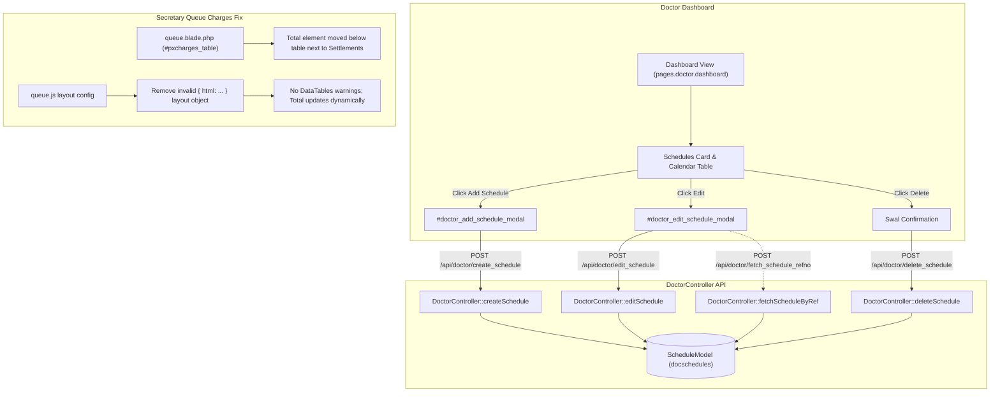

# Implementation Plan: Doctor Schedule Management & Secretary Queue Charges DataTable Fix

This plan establishes the architecture and implementation steps to allow doctors to directly add, edit, and delete their clinic schedules, and resolves the DataTables 2 warning (`Unknown feature: html`) on the Secretary Queue Patient payment details table (`#pxcharges_table`).

---

## 1. Goal Description

1. **Doctor Schedule Management**:
   - Currently, doctor schedules can only be created by admins or secretaries through the admin panel/secretary management.
   - On the Doctor Dashboard ([`resources/views/pages/doctor/dashboard.blade.php`](file:///C:/docker/php_projects/kayakapmd_clinic/resources/views/pages/doctor/dashboard.blade.php)), schedules are displayed as read-only text without Add, Edit, or Delete controls.
   - Furthermore, existing schedule management endpoints in [`routes/api.php`](file:///C:/docker/php_projects/kayakapmd_clinic/routes/api.php) are strictly gated behind `auth:secretary,admin`, returning 401 Unauthorized if invoked by an authenticated doctor.
   - **Solution**:
     - Introduce dedicated, secure doctor schedule endpoints in [`DoctorController.php`](file:///C:/docker/php_projects/kayakapmd_clinic/app/Http/Controllers/DoctorController.php) (`createSchedule`, `editSchedule`, `deleteSchedule`, `fetchScheduleByRef`) scoped strictly to `auth()->guard('doctor')->user()->docrefno`.
     - Register the endpoints in [`routes/api.php`](file:///C:/docker/php_projects/kayakapmd_clinic/routes/api.php) under `auth:doctor,admin` and permit doctor access to generic schedule routes.
     - Add dedicated Add Schedule and Edit Schedule modals in [`doctor_schedule.blade.php`](file:///C:/docker/php_projects/kayakapmd_clinic/resources/views/modals/doctor_schedule.blade.php) and wire them to the Doctor Dashboard.
     - Enhance [`dashboard.js`](file:///C:/docker/php_projects/kayakapmd_clinic/resources/js/pages/doctor/dashboard.js) and [`doctor.js`](file:///C:/docker/php_projects/kayakapmd_clinic/resources/js/doctor.js) with full CRUD operations, SweetAlert2 confirmations, loading indicators, and dynamic re-rendering.

2. **Secretary Queue Charges DataTable Fix (`Unknown feature: html`)**:
   - In [`resources/js/pages/secretary/queue.js`](file:///C:/docker/php_projects/kayakapmd_clinic/resources/js/pages/secretary/queue.js#L368-L372), the `#pxcharges_table` configuration uses:
     ```javascript
     layout: {
         bottomStart: {
             html: `<h4 class="fw-bold m-0 mt-2">Total: ₱<span class="fw-normal ms-1" id="charges_total">0.00</span></h4>`
         }
     }
     ```
   - In DataTables 2 (`datatables.net ^2.3.5`), passing `{ html: '...' }` inside a layout slot instructs DataTables to locate a registered feature named `html` (`DataTable.feature.html`). Because no such feature exists, DataTables triggers an alert modal:
     `DataTables warning: table id=pxcharges_table - Unknown feature: html`.
   - **Solution**:
     - Move the `#charges_total` display element directly into the Blade view ([`queue.blade.php`](file:///C:/docker/php_projects/kayakapmd_clinic/resources/views/pages/secretary/queue.blade.php)) alongside the Settlements button.
     - Clean up the DataTables `layout` option in [`queue.js`](file:///C:/docker/php_projects/kayakapmd_clinic/resources/js/pages/secretary/queue.js) to standard features (`layout: { bottomStart: 'paging', bottomEnd: null }`) or a proper function callback.
     - Also clean up similar layout patterns in [`secretary.js`](file:///C:/docker/php_projects/kayakapmd_clinic/resources/js/secretary.js), [`doctor.js`](file:///C:/docker/php_projects/kayakapmd_clinic/resources/js/doctor.js), and [`form.js`](file:///C:/docker/php_projects/kayakapmd_clinic/resources/js/pages/doctor/consultation/form.js).

---

## 2. User Review Required

> [!IMPORTANT]
> **Schedule Authorization Scoping**:
> When a doctor adds, edits, or deletes a schedule, the backend will strictly enforce `docrefno = auth()->guard('doctor')->user()->docrefno`. A doctor will not be able to alter any other doctor's schedule records.

> [!NOTE]
> **Database Schema Alignment (`docschedules`)**:
> Per [.gemini/database/kayakapmdv2_data_dictionary.md](file:///C:/docker/php_projects/kayakapmd_clinic/.gemini/database/kayakapmdv2_data_dictionary.md#L472) and [`2026_09_19_111708_create_docschedules_table.php`](file:///C:/docker/php_projects/kayakapmd_clinic/database/migrations/2026_09_19_111708_create_docschedules_table.php), the `docschedules` table has columns `dw_clientcode`, `schedrefno`, `docrefno`, `day` (enum), `start` (time), and `end` (time). It does not have a `notes` column in the database schema. The UI form will capture `day`, `start`, and `end` time, and only pass `notes` if the column exists to avoid SQLSTATE 42S22 column errors.

---

## 3. Proposed Changes



### Backend & API Layer

#### [MODIFY] [`app/Http/Controllers/DoctorController.php`](file:///C:/docker/php_projects/kayakapmd_clinic/app/Http/Controllers/DoctorController.php)
- Add `createSchedule(Request $request)`:
  - Validates `day` (enum Sunday-Saturday), `start`, `end`.
  - Sets `dw_clientcode` and `docrefno` strictly from authenticated doctor (`auth()->guard('doctor')->user()->docrefno`).
  - Generates `schedrefno`.
  - Persists with `ScheduleModel::create`.
  - Structured log `Log::info('Doctor created schedule', ...)`.
  - Returns `{ success: true, schedule: $schedule }`.
- Add `fetchScheduleByRef(Request $request)`:
  - Fetches schedule by `schedrefno` verifying ownership: `where('docrefno', $doctor->docrefno)`.
  - Returns `{ success: true, sched: $schedule }`.
- Add `editSchedule(Request $request)`:
  - Validates `schedrefno`, `day`, `start`, `end`.
  - Updates where `schedrefno = $request->schedrefno` and `docrefno = $doctor->docrefno`.
  - Structured log `Log::info('Doctor updated schedule', ...)`.
  - Returns `{ success: true, schedule: $schedule }`.
- Add `deleteSchedule(Request $request)`:
  - Deletes where `schedrefno = $request->schedrefno` and `docrefno = $doctor->docrefno`.
  - Structured log `Log::info('Doctor deleted schedule', ...)`.
  - Returns `{ success: true, message: 'Schedule deleted successfully.' }`.

#### [MODIFY] [`routes/api.php`](file:///C:/docker/php_projects/kayakapmd_clinic/routes/api.php)
- Register doctor-specific schedule routes inside `Route::middleware(['web', 'auth:doctor,admin'])`:
  ```php
  Route::post('doctor/create_schedule', [DoctorController::class, 'createSchedule'])->name('doctor.create_schedule');
  Route::post('doctor/fetch_schedule_refno', [DoctorController::class, 'fetchScheduleByRef'])->name('doctor.fetch_schedule_refno');
  Route::post('doctor/edit_schedule', [DoctorController::class, 'editSchedule'])->name('doctor.edit_schedule');
  Route::post('doctor/delete_schedule', [DoctorController::class, 'deleteSchedule'])->name('doctor.delete_schedule');
  ```
- Update schedule routes (`fetch_doctor_schedules`, `create_doctor_schedules`, `fetch_schedule_refno`, `edit_schedule`, `delete_schedule`) to be accessible by `auth:doctor,secretary,admin` so both generic and role-scoped endpoints succeed seamlessly.

---

### Views & Blade Templates

#### [NEW] [`resources/views/modals/doctor_schedule.blade.php`](file:///C:/docker/php_projects/kayakapmd_clinic/resources/views/modals/doctor_schedule.blade.php)
- Create dedicated modal file containing:
  - `#doctor_add_schedule_modal`:
    - Dropdown for Day of Week (`Monday` through `Sunday`).
    - Time inputs: Start Time (`start`) and End Time (`end`).
    - Action buttons: Cancel and Save (`#save_doctor_schedule_btn`).
  - `#doctor_edit_schedule_modal`:
    - Hidden input: `schedrefno` (`#edit_sched_refno`).
    - Dropdown for Day of Week (`#edit_sched_day`).
    - Time inputs: Start Time (`#edit_sched_start`) and End Time (`#edit_sched_end`).
    - Action buttons: Cancel and Update (`#update_doctor_schedule_btn`).

#### [MODIFY] [`resources/views/pages/doctor/dashboard.blade.php`](file:///C:/docker/php_projects/kayakapmd_clinic/resources/views/pages/doctor/dashboard.blade.php)
- Update the Schedules Card header with an **Add Schedule** button:
  ```html
  <div class="card-header text-bg-success d-flex justify-content-between align-items-center">
      <h5 class="card-title m-0"><i class="fa-solid fa-calendar-days me-1"></i> Schedules</h5>
      <button type="button" class="btn btn-sm btn-light text-success fw-bold" id="add_doctor_schedule_btn">
          <i class="fa-solid fa-plus"></i> Add Schedule
      </button>
  </div>
  ```
- Push `@include('modals.doctor_schedule')` into `@push('modals')`.

#### [MODIFY] [`resources/views/pages/secretary/queue.blade.php`](file:///C:/docker/php_projects/kayakapmd_clinic/resources/views/pages/secretary/queue.blade.php)
- Under `#pxcharges_table`, format the footer section to cleanly house the total balance and settlements button:
  ```html
  <div class="d-flex justify-content-between align-items-center mt-2">
      <h4 class="fw-bold m-0">Total: ₱<span class="fw-normal ms-1" id="charges_total">0.00</span></h4>
      <button type="button" class="btn btn-primary" data-bs-toggle="modal"
          data-bs-target="#settlementModal" id="settlement_btn">
          <i class="fa-solid fa-credit-card"></i> Settlements
      </button>
  </div>
  ```
- Remove duplicate commented-out `#pxcharges_table` block to prevent duplicate ID DOM conflicts.

---

### JavaScript & Frontend Logic

#### [MODIFY] [`resources/js/pages/doctor/dashboard.js`](file:///C:/docker/php_projects/kayakapmd_clinic/resources/js/pages/doctor/dashboard.js)
- Wrap schedule fetching into a reusable `loadDoctorSchedules()` function.
- Update `renderSchedules(schedules)`:
  - Group by day.
  - Render each schedule row with formatted 12-hour times (`convert24To12(sched.start) - convert24To12(sched.end)`).
  - Append action buttons:
    - `<button class="btn btn-sm btn-outline-primary edit-doctor-schedule me-1" value="${sched.schedrefno}" title="Edit"><i class="fa-solid fa-pen-to-square"></i></button>`
    - `<button class="btn btn-sm btn-outline-danger delete-doctor-schedule" value="${sched.schedrefno}" title="Delete"><i class="fa-solid fa-trash"></i></button>`
  - Handle empty schedule state gracefully (`No clinic schedules set yet.`).
- Add event listeners:
  - `#add_doctor_schedule_btn`: Opens `#doctor_add_schedule_modal` and resets fields.
  - `#save_doctor_schedule_btn`: Validates times, submits to `/api/doctor/create_schedule`, shows SweetAlert2 toast, hides modal, and reloads schedules.
  - `.edit-doctor-schedule`: Fetches schedule details from `/api/doctor/fetch_schedule_refno`, populates `#doctor_edit_schedule_modal`, and opens it.
  - `#update_doctor_schedule_btn`: Validates and submits updates to `/api/doctor/edit_schedule`, shows toast, and reloads schedules.
  - `.delete-doctor-schedule`: Displays SweetAlert2 confirmation dialog; upon confirmation, sends delete request to `/api/doctor/delete_schedule` and reloads schedules.

#### [MODIFY] [`resources/js/doctor.js`](file:///C:/docker/php_projects/kayakapmd_clinic/resources/js/doctor.js)
- Bring parity to legacy/fallback `doctor.js` script for schedule actions and clean up invalid DataTables layout configurations.

#### [MODIFY] [`resources/js/pages/secretary/queue.js`](file:///C:/docker/php_projects/kayakapmd_clinic/resources/js/pages/secretary/queue.js)
- Replace invalid DataTables 2 `layout: { bottomStart: { html: ... } }` in `loadPatientCharges()` with:
  ```javascript
  layout: {
      bottomStart: 'paging',
      bottomEnd: null
  }
  ```
- Eliminate the `Unknown feature: html` warning permanently.

#### [MODIFY] [`resources/js/secretary.js`](file:///C:/docker/php_projects/kayakapmd_clinic/resources/js/secretary.js) & [`resources/js/pages/doctor/consultation/form.js`](file:///C:/docker/php_projects/kayakapmd_clinic/resources/js/pages/doctor/consultation/form.js)
- Clean up matching invalid `{ div: { html: ... } }` layout definitions to ensure 0 DataTables warnings across all roles.

---

### Automated Testing

#### [MODIFY] [`tests/Feature/DoctorSecretaryConsoleTest.php`](file:///C:/docker/php_projects/kayakapmd_clinic/tests/Feature/DoctorSecretaryConsoleTest.php)
- Add comprehensive Feature tests:
  - `test_doctor_can_create_schedule()`: Authenticates as doctor, calls `/api/doctor/create_schedule`, asserts status 200, checks persistence in `docschedules` under the doctor's `docrefno`.
  - `test_doctor_can_fetch_and_edit_schedule()`: Creates schedule, fetches via `/api/doctor/fetch_schedule_refno`, updates via `/api/doctor/edit_schedule`, asserts updated times.
  - `test_doctor_can_delete_schedule()`: Deletes schedule via `/api/doctor/delete_schedule`, verifies it no longer exists in database.
  - `test_doctor_cannot_modify_other_doctor_schedule()`: Ensures doctor A cannot edit or delete doctor B's schedule (404/authorization check).
  - `test_secretary_fetch_pxcharges_response_structure()`: Verifies charges endpoint payload and total calculation without errors.

---

## 4. Verification Plan

### Automated Tests
Execute in Docker container:
```bash
docker exec -w /var/www/html/kayakapmd_clinic latest_php_server php artisan test --filter=DoctorSecretaryConsoleTest
docker exec -w /var/www/html/kayakapmd_clinic latest_php_server php artisan test
```
Criteria: All 33+ tests must pass with 0 failures and 0 regressions.

### Frontend Asset Compilation
```bash
npm run build
```
Criteria: Vite must compile cleanly with 0 errors.

### Manual Verification
1. **Doctor Schedules**:
   - Log in as Doctor (`gregoryhouse` / `password`).
   - Navigate to Doctor Dashboard (`/doctor/dashboard`).
   - Verify the Schedules Card displays the "Add Schedule" button.
   - Click "Add Schedule", choose Wednesday 09:00 - 13:00, save.
   - Verify the new schedule appears immediately in the table under Wednesday.
   - Click Edit on that schedule, change end time to 14:00, save, verify time updates.
   - Click Delete on that schedule, confirm prompt, verify it is removed.
2. **Secretary Charges DataTable Warning**:
   - Log in as Secretary (`secretary` / `secretary123`).
   - Navigate to Secretary Queue (`/secretary/queue`).
   - Import a patient and click "Patient Charges" or view payment details.
   - Verify `#pxcharges_table` initializes without any DataTables warning popup (`Unknown feature: html`).
   - Verify the total amount is rendered cleanly and accurately.
