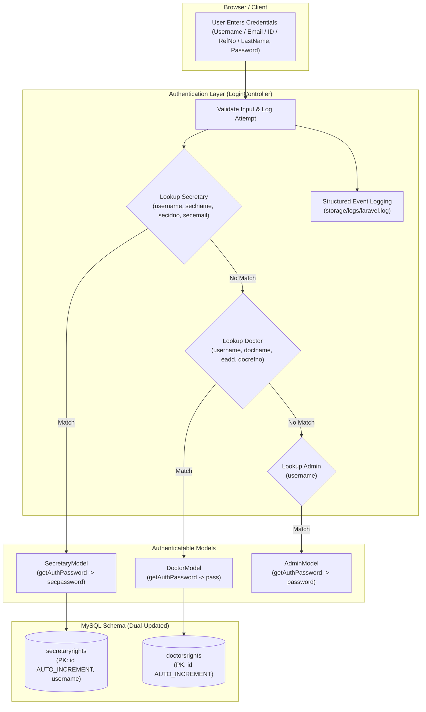

# Implementation Plan: Enable Application Logging, Update Documentation Protocols, and Fix Doctor & Secretary Authentication

## Goal Description
This plan addresses three core project requirements:
1. **Enable Comprehensive Application Logging**: Implement structured, contextual application logging throughout the entire project (authentication lifecycle, HTTP requests/responses, controller actions across Doctor, Secretary, Admin, API, and Consultation modules, and global unhandled exception tracking) writing to `storage/logs/laravel.log`, while suppressing repetitive polling clutter.
2. **Update Project Operational Documentation (`rules.md`, `skills.md`, `.agents/skills/kayakapmd-workflow/SKILL.md`)**: Establish mandatory rules requiring all AI agents and developers to save implementation plans in `.gemini/implementation plans/*.md` and walkthroughs in `.gemini/walkthroughs/*.md`.
3. **Resolve Doctor & Secretary Login Failures**:
   - Enable multi-field login for **both** doctors and secretaries (supporting `username`, email, ID/refno, and last name).
   - Ensure `secretaryrights` has a `username` column or alias so secretaries can log in via an explicit `username`, `seclname`, `secidno`, or `secemail`.
   - Implement `getAuthPassword()` and `getAuthPasswordName()` on `DoctorModel` (`pass`) and `SecretaryModel` (`secpassword`).
   - Fix database schema missing Primary Keys and `null` `id` entries in `doctorsrights` and `secretaryrights`.
   - Fix `clientcode` session assignment for doctors and secretaries (`dw_clientcode` / fallback to facility code).

---

## User Review Required

> [!IMPORTANT]
> **User-Approved Decisions Incorporated:**
> 1. **Multi-Field Authentication for Both Roles**:
>    - **Secretary**: Accepts `username`, `seclname` (last name), `secidno` (ID number e.g. `2026002`), or `secemail`.
>    - **Doctor**: Accepts `username`, `doclname` (last name), `eadd` (email), or `docrefno` (reference number).
> 2. **Logging Volume Optimization**:
>    - Mutating web and API requests (POST/PUT/DELETE) and key operations are logged at `info` level.
>    - Repetitive polling endpoints (e.g. `fetch_todays_patients`, `fetch_consultation_patients`, `fetch_today_patients`, `generate_new_codes`) are suppressed from repetitive request-logging to keep `storage/logs/laravel.log` clean and focused on actionable events.

> [!IMPORTANT]
> **Database Schema Dual-Update Protocol (Rule 4 Compliance):**
> Both `doctorsrights` and `secretaryrights` currently lack a Primary Key on `id` and have non-incrementing `id` columns containing `null` entries. Additionally, `secretaryrights` will be enhanced with a `username` column. We will create an idempotent database migration (`database/migrations/YYYY_MM_DD_HHMMSS_fix_auth_tables_primary_keys.php`) to:
> 1. Assign sequential integer IDs to any records where `id IS NULL`.
> 2. Safely add the `PRIMARY KEY (id)` and `AUTO_INCREMENT` attribute.
> 3. Add `username` to `secretaryrights` if not present (populating it from `seclname` as default).
> 4. Concurrently update [.gemini/database/kayakapmdv2_data_dictionary.md](file:///C:/docker/php_projects/kayakapmd_clinic/.gemini/database/kayakapmdv2_data_dictionary.md) per Rule 4.

---

## Proposed Changes



---

### Component 1: Operational Rules & Skills Documentation

#### [MODIFY] [rules.md](file:///C:/docker/php_projects/kayakapmd_clinic/rules.md)
- Add explicit mandatory protocol in Rule 2 and Pre-Execution Workflow Checklist:
  - All AI agents and developers must save implementation plans in `.gemini/implementation plans/<plan_name>.md`.
  - All AI agents and developers must save walkthroughs in `.gemini/walkthroughs/<walkthrough_name>.md`.

#### [MODIFY] [skills.md](file:///C:/docker/php_projects/kayakapmd_clinic/skills.md)
- Update Skill 2 and Skill 7 playbooks specifying file creation, naming standards, and markdown structure for `.gemini/implementation plans/` and `.gemini/walkthroughs/`.

#### [MODIFY] [.agents/skills/kayakapmd-workflow/SKILL.md](file:///C:/docker/php_projects/kayakapmd_clinic/.agents/skills/kayakapmd-workflow/SKILL.md)
- Update native Antigravity skill instructions to require persisting plans and walkthroughs to `.gemini/` folders.

---

### Component 2: Database Schema & Data Dictionary (Rule 4 Dual-Update)

#### [NEW] `database/migrations/2026_09_18_000000_fix_auth_tables_primary_keys.php`
- Add idempotent migration:
  - Assign sequential positive integers to any records with `id IS NULL` in `secretaryrights` and `doctorsrights`.
  - Add `PRIMARY KEY (id)` and `AUTO_INCREMENT` attribute on `id` in both `secretaryrights` and `doctorsrights`.
  - Add nullable, indexed `username` column to `secretaryrights` if missing, defaulting to `LOWER(seclname)` for existing rows.
  - Ensure clean rollback in `down()`.

#### [MODIFY] [.gemini/database/kayakapmdv2_data_dictionary.md](file:///C:/docker/php_projects/kayakapmd_clinic/.gemini/database/kayakapmdv2_data_dictionary.md)
- Update `doctorsrights` table definition: document `id` as Primary Key with auto-increment.
- Update `secretaryrights` table definition: document `id` as Primary Key with auto-increment, `username`, and `clientcode`.

---

### Component 3: Models & Authentication Layer

#### [MODIFY] [app/Models/DoctorModel.php](file:///C:/docker/php_projects/kayakapmd_clinic/app/Models/DoctorModel.php)
- Explicitly declare `protected $primaryKey = 'id';`.
- Add `public function getAuthPassword()` returning `$this->pass`.
- Add `public function getAuthPasswordName()` returning `'pass'`.
- Add accessor `getClientcodeAttribute()` returning `$this->dw_clientcode`.
- Add detailed comments explaining Authenticatable methods.

#### [MODIFY] [app/Models/SecretaryModel.php](file:///C:/docker/php_projects/kayakapmd_clinic/app/Models/SecretaryModel.php)
- Explicitly declare `protected $primaryKey = 'id';`.
- Add `'username'` to `$fillable`.
- Add `public function getAuthPassword()` returning `$this->secpassword`.
- Add `public function getAuthPasswordName()` returning `'secpassword'`.
- Add detailed comments explaining Authenticatable methods.

#### [MODIFY] [app/Http/Controllers/LoginController.php](file:///C:/docker/php_projects/kayakapmd_clinic/app/Http/Controllers/LoginController.php)
- Implement multi-field lookup for secretary:
  ```php
  $secretary = SecretaryModel::where(function ($q) use ($credentials) {
      $q->where('username', $credentials['username'])
        ->orWhere('seclname', $credentials['username'])
        ->orWhere('secidno', $credentials['username'])
        ->orWhere('secemail', $credentials['username']);
  })->first();
  ```
- Implement multi-field lookup for doctor:
  ```php
  $doctor = DoctorModel::where(function ($q) use ($credentials) {
      $q->where('username', $credentials['username'])
        ->orWhere('doclname', $credentials['username'])
        ->orWhere('eadd', $credentials['username'])
        ->orWhere('docrefno', $credentials['username']);
  })->first();
  ```
- Use resolved facility client code fallback: `$clientcode = $user->dw_clientcode ?? $user->clientcode ?? config('app.client_code', '122377');`.
- Add structured logging for login attempt, credentials match/failure, session configuration, and sign-out.

#### [MODIFY] [database/seeders/UserSeeder.php](file:///C:/docker/php_projects/kayakapmd_clinic/database/seeders/UserSeeder.php)
- Ensure clean doctor test record (username `doctor` or `Juan`, pass `12345`, valid `docrefno`, matching `DoctorsProfileModel`).
- Ensure clean secretary test record (username `secretary`, `seclname` `Doe`, `secidno` `2026002`, `secemail` `secretary.dummy@gmail.com`, pass `12345`, `verified` `true`).

---

### Component 4: Application-Wide Structured Logging Infrastructure

#### [NEW] [app/Http/Middleware/RequestLoggingMiddleware.php](file:///C:/docker/php_projects/kayakapmd_clinic/app/Http/Middleware/RequestLoggingMiddleware.php)
- Intercept incoming HTTP requests:
  - Skip noisy polling paths (`*/queue/count`, `*fetch_todays_patients*`, `*fetch_consultation_patients*`, `*generate_new_codes*`).
  - Log standard requests with method, path, IP, active auth guard/user ID, execution time (ms), and response status code.
  - Log mutating actions (POST/PUT/DELETE) at `info` level and GETs at `debug` level.

#### [MODIFY] [bootstrap/app.php](file:///C:/docker/php_projects/kayakapmd_clinic/bootstrap/app.php)
- Register `RequestLoggingMiddleware` in the `web` and `api` middleware stacks.
- Configure `->withExceptions()` to log uncaught exceptions with URL, method, user ID, and sanitized payload.

#### [MODIFY] Core Controllers (Doctor, Secretary, Management, Consultation):
- Inject structured `Log::info` and `Log::error` statements at major business logic operations (consultations, prescription saves, diagnostics, user management).

---

## Verification Plan

### Automated Tests
1. **Auth Test Suite** in [tests/Feature/AuthTest.php](file:///C:/docker/php_projects/kayakapmd_clinic/tests/Feature/AuthTest.php):
   - Doctor login via username, email, docrefno, and last name.
   - Secretary login via username, last name, ID number, and email.
   - Invalid credentials rejection.
   - Verified session persistence to `/doctor/dashboard` and `/secretary/queue`.
   - PreventBackHistory anti-cache verification.
2. Run test suite:
   ```bash
   docker exec -w /var/www/html/kayakapmd_clinic latest_php_server php artisan test --filter=AuthTest
   ```

### Manual & Log Verification
1. Verify `storage/logs/laravel.log`:
   - Inspect log output for structured request logs, login events, and controller actions without polling noise.
2. Multi-Role Browser Login Verification:
   - Login as Doctor -> Confirm dashboard renders.
   - Login as Secretary -> Confirm queue renders.
   - Login as Admin -> Confirm dashboard renders.
   - Test Sign out across all roles.
3. Documentation Verification:
   - Confirm [.gemini/implementation plans/enable_app_logging_and_auth_fix_plan.md](file:///C:/docker/php_projects/kayakapmd_clinic/.gemini/implementation%20plans/enable_app_logging_and_auth_fix_plan.md) exists.
   - Confirm [rules.md](file:///C:/docker/php_projects/kayakapmd_clinic/rules.md) and [skills.md](file:///C:/docker/php_projects/kayakapmd_clinic/skills.md) are updated.
