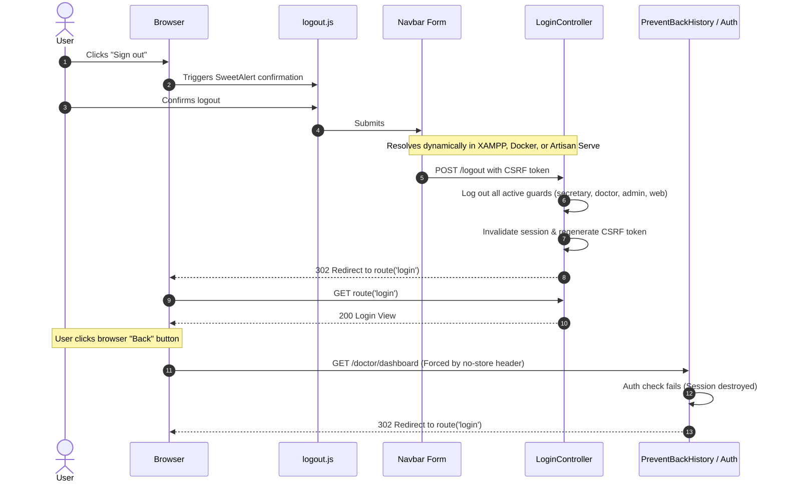

# Implementation Plan: Fix Dashboard Access After Logout & Repair Logout Button

## Goal Description
Resolve authentication and session security issues in KayakapMD Clinic while ensuring 100% compatibility across all three execution environments:
1. **XAMPP Local Development**: Subdirectory routing under `htdocs` (e.g. `http://localhost/kayakapmd_clinic/`).
2. **PHP Docker Container (`latest_php_server`)**: Apache server using VirtualHost or subdirectory routing on port 10000 (e.g. `http://localhost:10000/kayakapmd_clinic/` or vhost on `kayakapmd.conf`).
3. **Laravel Built-in Server & Vite (`php artisan serve` / `npm run dev`)**: Running directly on `http://127.0.0.1:8000/` or `http://localhost:8000/`.

### The Problems
1. **Broken Logout Button**:
   - [resources/js/logout.js](file:///C:/docker/php_projects/kayakapmd_clinic/resources/js/logout.js) hardcodes `url: "/logout"` and `window.location.href = "/login"`.
   - When running under a subfolder (XAMPP `http://localhost/kayakapmd_clinic/` or Docker `http://localhost:10000/kayakapmd_clinic/`), the browser sends the POST request to the domain root (`/logout`), stripping the `/kayakapmd_clinic` prefix. Apache returns 301/404, the request never reaches Laravel, and the user is **never logged out**.
   - Furthermore, `logout.js` lacks an error callback, causing silent failures, and has no server-side fallback form.
2. **Dashboard Still Accessible After Logout**:
   - **Un-invalidated Sessions**: Because the logout request failed, the session remained active on the server.
   - **Back-Forward Cache (bfcache)**: Modern browsers store rendered HTML pages in memory. Without explicit `Cache-Control: no-cache, no-store, max-age=0, must-revalidate` headers, clicking the browser "Back" button re-displays cached dashboard HTML even if the session has ended on the server.
   - **Loop Early Break**: In [LoginController.php](file:///C:/docker/php_projects/kayakapmd_clinic/app/Http/Controllers/LoginController.php), `logout()` breaks after the first guard instead of verifying and logging out all guards (`doctor`, `secretary`, `admin`, `web`).



---

## User Review Required

> [!IMPORTANT]
> **Universal Environment Compatibility Strategy:**
> To eliminate hardcoded URL discrepancies across XAMPP, Docker Apache (`kayakapmd.conf`), and Artisan Serve:
> 1. All routing uses Laravel's dynamic `route('logout')` and `route('login')` helpers, which inspect incoming request hosts, ports, and subdirectories automatically.
> 2. The primary sign-out mechanism uses a hidden native HTML form `<form id="logout-form" action="{{ route('logout') }}" method="POST">@csrf</form>` triggered by SweetAlert. Native form submission handles CSRF and redirects natively without JavaScript URL path assumptions.
> 3. An AJAX fallback is maintained using dynamic `<meta name="logout-url">` and `<meta name="login-url">` tags.

> [!NOTE]
> **PreventBackHistory Middleware:**
> Added to the `web` middleware group in `bootstrap/app.php`. Adds `no-cache, no-store, max-age=0, must-revalidate` response headers to all web routes so browsers are forbidden from showing cached dashboard data after logging out.

---

## Proposed Changes

### Controller & Authentication Layer

---

#### [MODIFY] [app/Http/Controllers/LoginController.php](file:///C:/docker/php_projects/kayakapmd_clinic/app/Http/Controllers/LoginController.php)
- Update `index()` to check if any guard is already logged in (`admin`, `doctor`, `secretary`) and redirect them to their respective dashboard (`route('admin')`, `route('doctor')`, `route('secretary')`).
- Update `logout()`:
  - Check and log out **all** guards in `config('auth.guards')` without `break;`.
  - Invalidate the session and regenerate the CSRF token.
  - Return JSON if `$request->ajax() || $request->wantsJson()` containing `{ success: true, redirect: route('login') }`.
  - Return `redirect()->route('login')` for standard form POSTs.
- Add detailed comments to all modified blocks per user rules.

```php
    public function index()
    {
        // Detailed Comment: Redirect already-authenticated users to their respective dashboards
        if (Auth::guard('admin')->check()) {
            return redirect()->route('admin');
        }
        if (Auth::guard('doctor')->check()) {
            return redirect()->route('doctor');
        }
        if (Auth::guard('secretary')->check()) {
            return redirect()->route('secretary');
        }

        return view('login');
    }

    public function logout(Request $request)
    {
        // Detailed Comment: Logout all active auth guards without breaking early
        foreach (array_keys(config('auth.guards')) as $guard) {
            if (Auth::guard($guard)->check()) {
                Auth::guard($guard)->logout();
            }
        }

        $request->session()->invalidate();
        $request->session()->regenerateToken();

        // Detailed Comment: Support both AJAX calls and native form submissions across all environments
        if ($request->ajax() || $request->wantsJson()) {
            return response()->json([
                'success' => true,
                'redirect' => route('login'),
            ]);
        }

        return redirect()->route('login');
    }
```

---

### Middleware & Application Bootstrap

---

#### [NEW] [app/Http/Middleware/PreventBackHistory.php](file:///C:/docker/php_projects/kayakapmd_clinic/app/Http/Middleware/PreventBackHistory.php)
- Strict cache-prevention headers to block browser bfcache across Apache (Docker/XAMPP) and `artisan serve`.

```php
<?php

namespace App\Http\Middleware;

use Closure;
use Illuminate\Http\Request;
use Symfony\Component\HttpFoundation\Response;

class PreventBackHistory
{
    /**
     * Handle an incoming request.
     * Detailed Comment: Appends strict cache control headers to prevent browsers from
     * storing authenticated dashboard pages in back-forward cache (bfcache).
     * This ensures that when a user logs out and clicks the browser 'Back' button,
     * the browser must query the server, where the auth middleware will reject the
     * request and redirect to the login page.
     */
    public function handle(Request $request, Closure $next): Response
    {
        $response = $next($request);

        $response->headers->set('Cache-Control', 'no-cache, no-store, max-age=0, must-revalidate');
        $response->headers->set('Pragma', 'no-cache');
        $response->headers->set('Expires', 'Sun, 02 Jan 1990 00:00:00 GMT');

        return $response;
    }
}
```

#### [MODIFY] [bootstrap/app.php](file:///C:/docker/php_projects/kayakapmd_clinic/bootstrap/app.php)
- Register `PreventBackHistory` in the `web` middleware group.
- Explicitly configure `$middleware->redirectGuestsTo(fn () => route('login'));`.

```php
    ->withMiddleware(function (Middleware $middleware): void {
        $middleware->alias([
            'role' => App\Http\Middleware\RoleMiddleware::class,
            'prevent-back-history' => App\Http\Middleware\PreventBackHistory::class,
        ]);
        $middleware->appendToGroup('web', App\Http\Middleware\PreventBackHistory::class);
        $middleware->redirectGuestsTo(fn () => route('login'));
    })
```

---

### Frontend & Views

---

#### [MODIFY] [resources/views/components/navbar.blade.php](file:///C:/docker/php_projects/kayakapmd_clinic/resources/views/components/navbar.blade.php) & [resources/views/template/navbar.blade.php](file:///C:/docker/php_projects/kayakapmd_clinic/resources/views/template/navbar.blade.php)
- Add a hidden form `#logout-form` with `action="{{ route('logout') }}"` and `@csrf`.

```blade
<form id="logout-form" action="{{ route('logout') }}" method="POST" class="d-none">
    @csrf
</form>
<button class="btn btn-light" id="logout" type="button">
    <span class="fa fa-arrow-right-from-bracket"></span> Sign out
</button>
```

#### [MODIFY] [resources/views/layouts/app.blade.php](file:///C:/docker/php_projects/kayakapmd_clinic/resources/views/layouts/app.blade.php)
- Inject `<meta name="logout-url" content="{{ route('logout') }}">` and `<meta name="login-url" content="{{ route('login') }}">` in `<head>`.

#### [MODIFY] [resources/js/logout.js](file:///C:/docker/php_projects/kayakapmd_clinic/resources/js/logout.js)
- Update click handler to use event delegation `$(document).on('click', '#logout', ...)`.
- On SweetAlert confirmation:
  - If `#logout-form` exists, submit it directly via `$form.submit()` (environment-agnostic).
  - If missing, fall back to AJAX using `meta[name="logout-url"]`, redirecting to `response.redirect` or `meta[name="login-url"]`.
  - Provide fallback in error handler to ensure the user is always redirected rather than left stuck.

```javascript
    // Detailed Comment: Resilient sign-out handler compatible with XAMPP, Docker Apache, and Artisan serve
    $(document).on("click", "#logout", function (e) {
        e.preventDefault();
        Swal.fire({
            title: "Logout?",
            text: "Are you sure you want to logout?",
            icon: "warning",
            showCancelButton: true,
            confirmButtonColor: "#3085d6",
            cancelButtonColor: "#d33",
            confirmButtonText: "Logout"
        }).then((result) => {
            if (result.isConfirmed) {
                const $form = $('#logout-form');
                if ($form.length) {
                    $form.submit();
                } else {
                    const logoutUrl = $('meta[name="logout-url"]').attr('content') || 'logout';
                    const loginUrl = $('meta[name="login-url"]').attr('content') || 'login';
                    $.ajax({
                        url: logoutUrl,
                        type: "POST",
                        headers: { 'X-CSRF-TOKEN': $('meta[name="csrf-token"]').attr('content') },
                        success: function (response) {
                            window.location.href = (response && response.redirect) ? response.redirect : loginUrl;
                        },
                        error: function () {
                            window.location.href = loginUrl;
                        }
                    });
                }
            }
        });
    });
```

---

### Automated Tests

---

#### [NEW] [tests/Feature/AuthTest.php](file:///C:/docker/php_projects/kayakapmd_clinic/tests/Feature/AuthTest.php)
- `test_unauthenticated_user_cannot_access_doctor_dashboard()`: asserts 302 redirect to `/login`.
- `test_unauthenticated_user_cannot_access_admin_dashboard()`: asserts 302 redirect to `/login`.
- `test_unauthenticated_user_cannot_access_secretary_queue()`: asserts 302 redirect to `/login`.
- `test_web_logout_invalidates_session_and_redirects_to_login()`: tests POST `/logout` redirects to `/login` and flushes session.
- `test_ajax_logout_returns_json_with_redirect_url()`: tests AJAX POST `/logout` returns JSON with redirect.
- `test_prevent_back_history_headers_are_present()`: asserts `Cache-Control` header contains `no-store, must-revalidate`.

---

## Verification Plan

### Automated Tests
```bash
php artisan test --filter=AuthTest
```
Expected output: All 6 test assertions pass with green status.

### Asset Compilation
```bash
npm run build
```
Verify compiled assets in `public/build/assets/`.

### Multi-Environment Verification
1. **Docker Container Verification**:
   - Make curl request to `http://localhost:10000/kayakapmd_clinic/doctor/dashboard` without session.
   - Verify HTTP 302 Redirect to `http://localhost:10000/kayakapmd_clinic/login`.
   - Verify response headers include `Cache-Control: no-cache, no-store, max-age=0, must-revalidate`.
2. **Artisan Serve Verification**:
   - Verify `php artisan test` and route resolution functions seamlessly on root domain.
3. **Manual Browser Verification**:
   - Login -> Click Sign out -> Confirm logout -> Browser lands on login page.
   - Click browser Back button -> Verify browser does not show dashboard and remains on login page.
