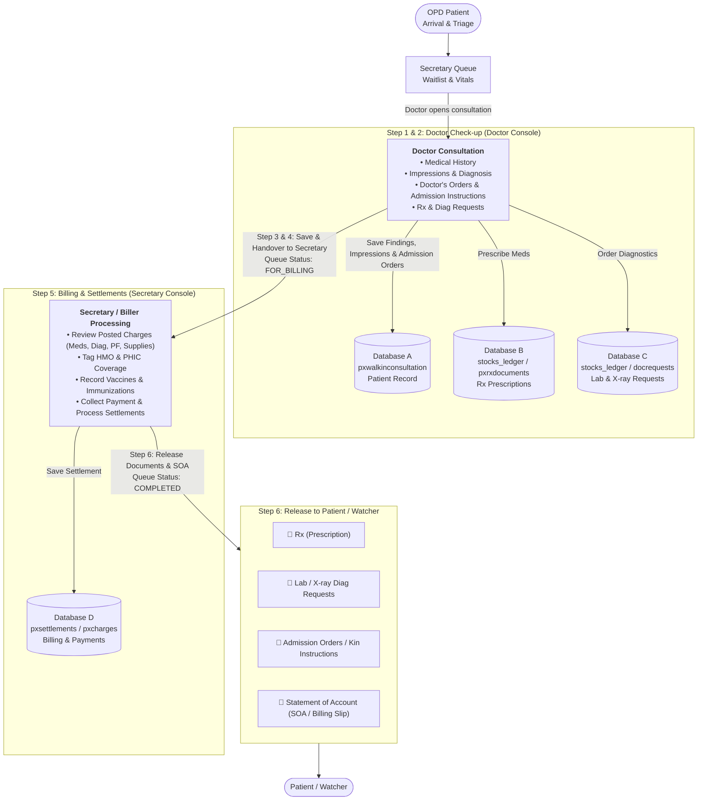

# Implementation Plan — OPD Consultation Workflow Alignment

Align the **KayakapMD Clinic** consultation system with the end-to-end workflow specified in [`.gemini/Opd consultation workflow.md`](file:///C:/docker/php_projects/kayakapmd_clinic/.gemini/Opd%20consultation%20workflow.md). This establishes a seamless transition across all four actors (**OPD Patient**, **Doctor**, **Secretary / Biller**, and **Patient / Watcher**) and synchronizes all four clinical data stores (**Database A**, **Database B**, **Database C**, and **Database D**).

---

## User Approved Alignment Decisions

The following architectural decisions have been confirmed:
1. **Queue Lifecycle Transition**: When the Doctor finishes consultation check-up, queue status will transition to **`FOR_BILLING`**. The Secretary queue will display a distinct primary badge showing the patient is ready for billing and document release. Upon payment settlement and document release, the Secretary clicks "Mark as Complete" to transition to **`COMPLETED`**.
2. **Secretary 1-Click Document Printing**: The Secretary consultation interface will feature 1-click print buttons for **Rx (Prescription)**, **Diagnostic Requests**, **Admission Instructions / Kin Instructions**, and **Statement of Account (SOA / Billing Slip)**.
3. **Admission Instructions & Orders (Database A)**: The Doctor Consultation modal will include dedicated fields for **`foradmit`** (checkbox: "For Admission") and **`foradmit_instructions`** (textarea: "Admission Orders & Instructions to Kin"), with dedicated PDF printing via `/print_pdf?type=admission`.

---

## Architecture & Workflow Alignment

The OPD consultation process flows through six distinct phases and coordinates four operational data stores:



### Data Store Mapping

| Data Store | Purpose in Workflow | Database Tables | Eloquent Models |
|---|---|---|---|
| **Database A** | Patient demographics, vitals, medical history, clinical impressions, diagnosis, doctor orders, and admission instructions | `pxwalkinconsultation`, `pxmasterlist` | [`ConsultationModel`](file:///C:/docker/php_projects/kayakapmd_clinic/app/Models/ConsultationModel.php), [`PatientMasterlist`](file:///C:/docker/php_projects/kayakapmd_clinic/app/Models/PatientMasterlist.php) |
| **Database B** | Prescriptions (Rx) and medication orders | `stocks_ledger` (`item_grouping = 'DRUGS AND MEDS'`), `pxrxdocuments` | [`StocksLedgerModel`](file:///C:/docker/php_projects/kayakapmd_clinic/app/Models/Stocks/StocksLedgerModel.php), [`DoctorMedicinesModel`](file:///C:/docker/php_projects/kayakapmd_clinic/app/Models/DoctorMedicinesModel.php) |
| **Database C** | Laboratory and Diagnostic Radiology exam requests | `stocks_ledger` (`item_grouping = 'DIAGNOSTIC'`), `dd_docrequests` | [`StocksLedgerModel`](file:///C:/docker/php_projects/kayakapmd_clinic/app/Models/Stocks/StocksLedgerModel.php), [`DocRequestsModel`](file:///C:/docker/php_projects/kayakapmd_clinic/app/Models/DocRequestsModel.php) |
| **Database D** | Charges, billings, fee breakdown, HMO/PHIC deductions, and payment settlements | `pxsettlements`, `pxcharges`, `stocks_ledger` | [`SettlementsModel`](file:///C:/docker/php_projects/kayakapmd_clinic/app/Models/SettlementsModel.php), [`StocksLedgerModel`](file:///C:/docker/php_projects/kayakapmd_clinic/app/Models/Stocks/StocksLedgerModel.php) |

---

## User Review Required

> [!IMPORTANT]
> **Database Migration & Data Dictionary Synchronization (Rule 4)**:
> Adding `FOR_BILLING` to the `status` enum on `pxwalkinconsultation` requires a new idempotent migration in `database/migrations/` and updating [`.gemini/database/kayakapmdv2_data_dictionary.md`](file:///C:/docker/php_projects/kayakapmd_clinic/.gemini/database/kayakapmdv2_data_dictionary.md).
> The migration will check `Schema::hasTable` and alter the column safely to avoid schema downtime or data loss.

> [!WARNING]
> **Bugfix in Secretary Queue**:
> Correct line 1032 in [`resources/js/pages/secretary/queue.js`](file:///C:/docker/php_projects/kayakapmd_clinic/resources/js/pages/secretary/queue.js) from `/api/delete_charge_doctor` to `/api/delete_patient_charge`.

---

## Proposed Changes

### Component 1: Schema & Data Dictionary Dual-Update (Rule 4)

#### [NEW] `database/migrations/2026_09_20_110000_add_for_billing_status_to_pxwalkinconsultation_table.php`
- Add `FOR_BILLING` to the `status` ENUM column in `pxwalkinconsultation`:
  `ENUM('PENDING','FOR CONFIRMATION','WAITING','IN_CONSULTATION','FOR_BILLING','COMPLETED','CANCELLED','NO_SHOW','UNSCHEDULED')`.
- Down method cleanly reverts to previous enum options without `FOR_BILLING`.

#### [MODIFY] `.gemini/database/kayakapmdv2_data_dictionary.md`
- Update `pxwalkinconsultation` specification (line 632) to document `FOR_BILLING`.

#### [MODIFY] [`app/Models/ConsultationModel.php`](file:///C:/docker/php_projects/kayakapmd_clinic/app/Models/ConsultationModel.php)
- Add missing attributes to `$fillable`:
  - `'instructions'`
  - `'foradmit'`
  - `'foradmit_instructions'`

---

### Component 2: Step 1 & 2 — Doctor Check-up & Admission Instructions (Database A)

#### [MODIFY] [`resources/views/modals/consultation_modal.blade.php`](file:///C:/docker/php_projects/kayakapmd_clinic/resources/views/modals/consultation_modal.blade.php)
- Under the "Impressions & Diagnosis" tab (or a dedicated "Doctor's Orders & Admission" section):
  - Checkbox `#foradmit` ("Patient Recommended for Admission").
  - Textarea `#foradmit_instructions` ("Admission Orders & Instructions to Kin / Caregiver").
  - Dedicated Print Button `#print_admit_btn` (`/print_pdf?type=admission`).
- Add `#print_inst_btn` URL linking for kin/home instructions.

#### [MODIFY] [`app/Http/Controllers/DoctorController.php`](file:///C:/docker/php_projects/kayakapmd_clinic/app/Http/Controllers/DoctorController.php)
- Update `saveImpressionsDiagnosis`:
  - Accept and save `foradmit` (0 or 1) and `foradmit_instructions`.
- Update `completeConsultation`:
  - Change status transition to `FOR_BILLING`.
- Update `printPDF`:
  - Support `type=admission`: Renders formatted admission orders & kin instructions with physician credentials.
  - Support `type=soa`: Renders itemized Statement of Account (Outpatient Billing Slip).

#### [MODIFY] [`resources/js/pages/doctor/consultation.js`](file:///C:/docker/php_projects/kayakapmd_clinic/resources/js/pages/doctor/consultation.js) & [`form.js`](file:///C:/docker/php_projects/kayakapmd_clinic/resources/js/pages/doctor/consultation/form.js)
- Populate `#foradmit` and `#foradmit_instructions` from `fetch_patient_data`.
- Include `foradmit` and `foradmit_instructions` in payload when `#save_impressions_diagnosis` is clicked.
- Set `#print_admit_btn` href to `/print_pdf?type=admission&consultationrefno=...`.

---

### Component 3: Step 3 & 4 — Document Handover & Secretary Queue Interface

#### [MODIFY] [`resources/views/pages/secretary/queue.blade.php`](file:///C:/docker/php_projects/kayakapmd_clinic/resources/views/pages/secretary/queue.blade.php)
- In the consultation form action bar / card header:
  - Add a "Print Documents" button group:
    - 🖨️ **Rx (Prescription)** (`#sec_print_rx_btn`)
    - 🖨️ **Diag Requests** (`#sec_print_diag_btn`)
    - 🖨️ **Admission / Kin Orders** (`#sec_print_admit_btn`)
    - 🖨️ **Statement of Account (SOA)** (`#sec_print_soa_btn`)
- In `#patients_queue_table` and `#patients_unsched_table`:
  - Add badge class for `FOR_BILLING` (`badge bg-primary text-white fs-6`).

#### [MODIFY] [`app/Http/Controllers/ConsultationController.php`](file:///C:/docker/php_projects/kayakapmd_clinic/app/Http/Controllers/ConsultationController.php)
- In `updateQueueStatus`:
  - Add `'FOR_BILLING'` to validation rule: `'status' => 'required|in:WAITING,IN_CONSULTATION,FOR_BILLING,COMPLETED,CANCELLED,NO_SHOW,ON_HOLD,SCHEDULED'`.
- In `fetchConsultation`:
  - Return `foradmit` and `foradmit_instructions` in JSON response.

---

### Component 4: Step 5 — Secretary Billing & Settlement (Database D)

#### [MODIFY] [`resources/js/pages/secretary/queue.js`](file:///C:/docker/php_projects/kayakapmd_clinic/resources/js/pages/secretary/queue.js)
- **Fix 404 Route**: Replace `url: "/api/delete_charge_doctor"` with `url: "/api/delete_patient_charge"` (line 1032).
- Update print button URLs whenever a patient is imported or selected in the queue.
- Support `FOR_BILLING` badge formatting in DataTable columns.

#### [MODIFY] [`resources/views/modals/settlement_modal.blade.php`](file:///C:/docker/php_projects/kayakapmd_clinic/resources/views/modals/settlement_modal.blade.php)
- Replace dummy placeholder `--:--` (`name="aaa" id="aaa"`) on line 58 with **PHIC (PhilHealth)** input:
  - Label: `PHIC`
  - Input: `name="phic" id="phic"`
- In the "View Settlements" tab:
  - Add readonly field `#info_phic` ("PHIC Coverage").

#### [MODIFY] [`app/Http/Controllers/SecretaryController.php`](file:///C:/docker/php_projects/kayakapmd_clinic/app/Http/Controllers/SecretaryController.php)
- In `saveSettlements`:
  - Save `$request->phic` into `less_phic` column.
  - Automatically calculate categorized totals (`total_meds`, `total_lab`, `total_xray`, `total_doctorspf`, `total_vaccines`, `total_immunizations`, `total_procedures`, `total_supplies`) from active charges in `stocks_ledger` and store in `pxsettlements`.

#### [MODIFY] [`app/Models/SettlementsModel.php`](file:///C:/docker/php_projects/kayakapmd_clinic/app/Models/SettlementsModel.php)
- Add `phic` virtual attribute to `$appends` with mutator/accessor mapped to `less_phic`.

---

### Component 5: Step 6 — Release to Patient / Watcher (Documents & Statement of Account)

#### [MODIFY] [`resources/views/printables/rx_print.blade.php`](file:///C:/docker/php_projects/kayakapmd_clinic/resources/views/printables/rx_print.blade.php)
- Implement layout for `type === "admission"`:
  - Header: **ADMISSION ORDERS & INSTRUCTIONS TO KIN**
  - Clinical details: Admitting Impression/Diagnosis, Special Care Instructions to Kin / Nursing, Attending Physician signature block.
- Implement layout for `type === "soa"`:
  - Header: **STATEMENT OF ACCOUNT (OUTPATIENT BILLING SLIP)**
  - Patient demographics, consultation reference code, transaction code.
  - Table of charges: Description, Grouping/Category, Quantity, Unit Price, Total Amount.
  - Financial summary: Total Gross, PhilHealth (PHIC) Coverage, HMO Coverage, Senior/PWD Discount, Net Payable.
  - Settlement breakdown: Cash, Card (CTA type), Settled by (Secretary / Cashier name).

---

## Verification Plan

### Automated Tests
1. Run existing test suite to ensure zero regressions:
   ```bash
   docker exec -w /var/www/html/kayakapmd_clinic latest_php_server php artisan test
   ```
2. Create dedicated feature test suite [`tests/Feature/OpdConsultationWorkflowTest.php`](file:///C:/docker/php_projects/kayakapmd_clinic/tests/Feature/OpdConsultationWorkflowTest.php):
   - Test Doctor saving impressions, diagnosis, and admission instructions (`foradmit`).
   - Test queue status transition from `IN_CONSULTATION` to `FOR_BILLING`.
   - Test Secretary viewing charges, applying PHIC + HMO deductions, and saving settlement.
   - Test PDF generation endpoints:
     - `/print_pdf?type=rx`
     - `/print_diagnostics`
     - `/print_pdf?type=admission`
     - `/print_pdf?type=soa`
   - Test charge deletion via `/api/delete_patient_charge` from Secretary guard.

### Manual Verification
1. **Doctor Flow**:
   - Log in as Doctor (`/doctor`).
   - Open `/doctor/consultation`, select a patient, click "Proceed Consultation".
   - Fill in Chief Complaints, Impressions, Diagnosis, and Admission Instructions.
   - Prescribe an Rx item and order a diagnostic request.
   - Click "Save Consultation" and verify status transitions to `FOR_BILLING`.
2. **Secretary Flow**:
   - Log in as Secretary (`/secretary/queue`).
   - Observe patient in `FOR_BILLING` status.
   - Select patient $\rightarrow$ verify all doctor charges appear under "Payment Details".
   - Open Settlements modal $\rightarrow$ verify Cash, Card (CTA), HMO, and PHIC fields function and disperse accurately.
   - Save settlement and verify summary in "View Settlements" tab.
   - Click Print buttons to verify Rx, Diag Requests, Admission Instructions, and SOA PDFs stream cleanly.
   - Click "Mark as Complete" to release to Patient/Watcher.
