# Implementation Plan: Fix Secretary Queue, Doctor Consultation & Upgrade Patient Management

This document details the architectural analysis, proposed modifications, code diffs, and verification strategies to resolve issues in the Secretary Queue, Doctor Consultation, and Patient Management modules in **KayakapMD Clinic**.

---

## 1. Goal Description

This implementation addresses three core operational areas:
1. **Secretary Queue (`/secretary/queue` & `admin/secretary`)**:
   - Resolve the inability to append patient charges in the Payment Details tab.
   - Fix diagnostic requests printing where requests are omitted from the generated PDF.
   - Ensure the Rx (Prescription) PDF contains strictly prescription medicines (`DRUGS AND MEDS`).
   - Fix currency rendering by changing the symbol from `?` to `PHP ` (or `₱` with fallback to `PHP `).
2. **Doctor Consultation (`/doctor/consultation`)**:
   - Fix diagnostic request printing so requested laboratory/radiology items are included in the generated PDF document.
   - Ensure prescription (Rx) printing strictly includes medicines only.
3. **Patient Management (`/doctor/patients` for Admin and Doctor)**:
   - Synchronize all patient fields with the authoritative [`pxmasterlist`](file:///C:/docker/php_projects/kayakapmd_clinic/.gemini/database/kayakapmdv2_data_dictionary.md#pxmasterlist) table schema.
   - Add patient consultation history viewing in the patient masterlist for both doctors and administrators.
   - Equip the Admin / Management console with full Edit and Deletion capabilities for masterlist patients.
   - Integrate asynchronous UI feedback loaders (button spinners, SweetAlert loaders, DataTables processing states) across every process.

---

## 2. Root Cause Analysis

### A. Secretary Queue Append Charges
- In [`resources/views/pages/secretary/queue.blade.php`](file:///C:/docker/php_projects/kayakapmd_clinic/resources/views/pages/secretary/queue.blade.php), the button `#append_pxcharges_btn` exists, and [`modals/append_charges.blade.php`](file:///C:/docker/php_projects/kayakapmd_clinic/resources/views/modals/append_charges.blade.php) is included.
- However, [`resources/js/pages/secretary/queue.js`](file:///C:/docker/php_projects/kayakapmd_clinic/resources/js/pages/secretary/queue.js) lacked an event listener for `#append_pxcharges_btn`.
- Furthermore, [`append_charges.blade.php`](file:///C:/docker/php_projects/kayakapmd_clinic/resources/views/modals/append_charges.blade.php) had misaligned IDs (`search_pxcharge`, `append_to_pxcharges_btn`, `pxsave_charges_btn`) and referenced a non-existent `#consultation_modal`.

### B. Diagnostic Requests Missing on PDF
- In [`DoctorController::saveDiagnosticRequest`](file:///C:/docker/php_projects/kayakapmd_clinic/app/Http/Controllers/DoctorController.php#L841-L859), when diagnostic requests were saved to `stocks_ledger`, the column `item_grouping` was left `NULL`.
- In [`DoctorController::printDiagnostics`](file:///C:/docker/php_projects/kayakapmd_clinic/app/Http/Controllers/DoctorController.php#L880-L967) and [`DoctorController::printPDF`](file:///C:/docker/php_projects/kayakapmd_clinic/app/Http/Controllers/DoctorController.php#L636-L745), queries looked for `item_grouping = 'DIAGNOSTIC'`. Because it was stored as `NULL`, zero items were retrieved, causing the PDF to output *"No diagnostic requests recorded."*

### C. Prescription (Rx) Printing Containing Non-Medicines
- In [`DoctorController::printPDF`](file:///C:/docker/php_projects/kayakapmd_clinic/app/Http/Controllers/DoctorController.php#L685-L690):
  ```php
  $ledgerMeds = StocksLedgerModel::where('px_consultcode_cn', $refno)
      ->where(function ($q) {
          $q->where('item_grouping', 'DRUGS AND MEDS')
            ->orWhereNull('item_grouping'); // <-- Bug: Captures diagnostic items and uncategorized charges
      })
  ```
- Any item with `item_grouping = NULL` (such as newly saved diagnostic requests or uncategorized charges) was erroneously displayed as a medicine on the Rx printout.

### D. Currency Symbol Rendering as `?`
- In [`resources/views/printables/rx_print.blade.php`](file:///C:/docker/php_projects/kayakapmd_clinic/resources/views/printables/rx_print.blade.php), DomPDF uses standard fonts (Helvetica/Times) which do not support Unicode glyph `₱` (U+20B1), rendering `?` on generated PDF slips.
- In web views and inputs, replacing or prefixing with `PHP ` (e.g. `PHP 1,250.00`) ensures cross-platform fidelity without encoding glitches.

### E. Patient Management Schema & Missing Actions
- In [`DoctorController::fetchAllPatients`](file:///C:/docker/php_projects/kayakapmd_clinic/app/Http/Controllers/DoctorController.php#L215-L277), an `INNER JOIN` with `pxwalkinconsultation` dropped patients who had no walk-in consultation and duplicated patients with multiple encounters.
- Patients in [`resources/views/pages/doctor/patients.blade.php`](file:///C:/docker/php_projects/kayakapmd_clinic/resources/views/pages/doctor/patients.blade.php) only showed 3 columns without consultation history, and the Admin lacked Edit and Deletion controls.
- The view modal [`resources/views/modals/view_patient.blade.php`](file:///C:/docker/php_projects/kayakapmd_clinic/resources/views/modals/view_patient.blade.php) only displayed a minimal subset of fields, omitting `phic_pin`, `religion`, `nationality`, detailed address parts (`streetadrs`, `brgy`, `muncity`, `province`, `zipcode`, `region`), and PWD/Senior Citizen identifiers.

---

## 3. User Review Required

> [!IMPORTANT]
> **1. Data Retention on Patient Deletion**:
> When an Administrator deletes a patient from the masterlist in `/doctor/patients`, should we delete the [`pxmasterlist`](file:///C:/docker/php_projects/kayakapmd_clinic/.gemini/database/kayakapmdv2_data_dictionary.md#pxmasterlist) record while keeping existing clinical consultation encounters in `pxwalkinconsultation` for medical history audit trail, or perform cascading deletion? *(Recommended: Delete from `pxmasterlist` while preserving existing medical consultation encounters for clinical audit compliance).*
>
> **2. Currency Representation**:
> We will standardize all printable PDFs to use `PHP ` (e.g., `PHP 500.00`) so DomPDF never outputs `?`, while in web interfaces displaying `PHP ` or `₱` with an automatic `PHP` fallback.

---

## 4. Proposed Changes

```mermaid
flowchart TD
    subgraph SecretaryQueue["Secretary Queue & Admin Secretary Panel"]
        SQ_Btn["#append_pxcharges_btn Click"] --> SQ_Modal["#append_charge_modal"]
        SQ_Modal --> SQ_Select["Select2 /api/fetch_all_charges + Price Fetch"]
        SQ_Select --> SQ_Append["Append to List & Compute Line Total"]
        SQ_Append --> SQ_Save["POST /api/save_patient_charges (with Loader)"]
        SQ_Save --> SQ_Reload["Reload #pxcharges_table via loadPatientCharges()"]
    end

    subgraph PDFPrinting["Diagnostic Requests & Rx PDF Generation"]
        DiagSave["DoctorController::saveDiagnosticRequest"] -->|Save with item_grouping = 'DIAGNOSTIC'| Ledger[stocks_ledger]
        PrintDiag["DoctorController::printDiagnostics"] -->|Query DIAGNOSTIC + stocks_listing fallback| DiagPDF["rx_print.blade.php (diagnostics)"]
        PrintRx["DoctorController::printPDF"] -->|Strict filter: DRUGS AND MEDS only| RxPDF["rx_print.blade.php (rx)"]
        Currency["All Printable Views"] -->|Replace '₱' with 'PHP '| CleanPDF["Clean PDF without '?'"]
    end

    subgraph PatientMgmt["Patient Management (/doctor/patients)"]
        FetchMaster["DoctorController::fetchAllPatients"] -->|Query pxmasterlist directly + leftJoin latest consul| MasterTable["#masterlist_table"]
        MasterTable --> ViewBtn["View: All pxmasterlist Fields"]
        MasterTable --> HistBtn["History: #patientMedhistoryModal"]
        MasterTable --> AdminControls["Admin Only: Edit & Delete"]
        AdminControls --> EditModal["#editPatientModal -> POST /api/admin/update_patient"]
        AdminControls --> DeleteAction["Swal Confirm -> POST /api/admin/delete_patient"]
    end
```



---

### Component 1: Diagnostic Requests & Prescription Printing Fixes

#### [MODIFY] [`app/Http/Controllers/DoctorController.php`](file:///C:/docker/php_projects/kayakapmd_clinic/app/Http/Controllers/DoctorController.php)
- In `saveDiagnosticRequest`: Ensure every created record sets:
  `'item_grouping' => 'DIAGNOSTIC'`, `'transactiontype' => 'CHARGES'`, and copies unit prices and PHIC codes.
- In `printDiagnostics`: Query `StocksLedgerModel` for `item_grouping = 'DIAGNOSTIC'` and join/match against `StocksListingModel` where `item_grouping = 'DIAGNOSTIC'`. Fallback to `DocRequestsModel`.
- In `printPDF`: Remove `->orWhereNull('item_grouping')`. Enforce strict `item_grouping = 'DRUGS AND MEDS'` so supplies, diagnostic requests, and fees never appear on Rx slips.

```php
// In DoctorController::saveDiagnosticRequest
public function saveDiagnosticRequest(Request $request)
{
    $patient = ConsultationModel::where(['consultationrefno' => $request->consultationrefno])->first();

    foreach ($request->diagnostics as $diags) {
        $item = StocksListingModel::where(['prodcode' => $diags])->first();
        $unitPrice = (float)($item->price_regular ?? $item->cost_ave ?? 0);

        StocksLedgerModel::create([
            'transactiontype' => 'CHARGES',
            'px_pin' => $patient->pxrefno ?? '',
            'px_consultcode_cn' => $request->consultationrefno,
            'patient_name' => $patient->patientname ?? $patient->patient_name ?? '',
            'prodcode' => $diags,
            'phic_reference_code' => $item->phic_reference_code ?? '',
            'item_dscr' => $item->prod_itemdscr ?? '',
            'qty' => 1,
            'cost_ave' => $unitPrice,
            'retails' => $unitPrice,
            'totalamt' => $unitPrice,
            'item_grouping' => 'DIAGNOSTIC' // Detailed Comment: Explicitly set DIAGNOSTIC grouping
        ]);
    }

    return response()->json(['success' => true]);
}

// In DoctorController::printPDF
$ledgerMeds = StocksLedgerModel::where('px_consultcode_cn', $refno)
    ->where('item_grouping', 'DRUGS AND MEDS') // Detailed Comment: Strict filter ensures non-medicine charges are excluded
    ->get()
    ->map(function ($item) { ... });
```

#### [MODIFY] [`resources/views/printables/rx_print.blade.php`](file:///C:/docker/php_projects/kayakapmd_clinic/resources/views/printables/rx_print.blade.php)
- Replace all instances of raw unicode `₱` with `PHP ` (e.g. `PHP {{ number_format(...) }}`) so DomPDF consistently outputs currency without question mark placeholders `?`.

---

### Component 2: Secretary Queue Charges Appending & Currency Display

#### [MODIFY] [`resources/views/modals/append_charges.blade.php`](file:///C:/docker/php_projects/kayakapmd_clinic/resources/views/modals/append_charges.blade.php)
- Harmonize modal markup so it functions seamlessly on `/secretary/queue` and `admin/secretary`:
  - Standard element IDs: Select2 `#sec_search_charge`, filter `#sec_search_filter`, quantity `#sec_charge_qty`, amount `#sec_charge_amount`.
  - Action buttons: `#sec_append_to_charges_btn`, `#sec_save_charges_btn`.
  - Appended charges table `#sec_appended_charges_table`.
  - Standard dismissible buttons (`data-bs-dismiss="modal"`).

#### [MODIFY] [`resources/js/pages/secretary/queue.js`](file:///C:/docker/php_projects/kayakapmd_clinic/resources/js/pages/secretary/queue.js)
- Bind click handler on `#append_pxcharges_btn`:
  - Validate that a patient consultation is selected (`#pxconsultationrefno`). If not, alert with SweetAlert.
  - If selected, reset modal fields and display `#append_charge_modal`.
- Initialize Select2 on `#sec_search_charge` calling `/api/fetch_all_charges`.
- On charge select, retrieve price via `/api/get_hmo_price` or default price.
- Bind `#sec_append_to_charges_btn` to add item to `secAppendedCharges` array and `#sec_appended_charges_table`.
- Bind `#sec_save_charges_btn` with button loader `setBtnLoading`:
  - POST to `/api/save_patient_charges` with `consultationrefno` and `chargerefnos`.
  - On success, reload `#pxcharges_table` using `loadPatientCharges()`, hide modal, show success toast, and reset loader.
- Update currency display from `₱` to `PHP ` / `₱` with fallback.

---

### Component 3: Patient Management (`/doctor/patients` for Admin & Doctor)

#### [MODIFY] [`app/Http/Controllers/DoctorController.php`](file:///C:/docker/php_projects/kayakapmd_clinic/app/Http/Controllers/DoctorController.php)
- Refactor `fetchAllPatients`:
  - Base query directly on `pxmasterlist` so all registered patients appear (using `leftJoin` or subqueries for latest consultation photo and encounter date).
  - Select and return all `pxmasterlist` fields:
    `id`, `pxrefno`, `pincode`, `patientname`, `pxfirstname`, `pxmidname`, `pxlastname`, `pxsuffix`, `gender`, `birthday`, `age`, `religion`, `nationality`, `mobilenumber`, `emailaddress`, `address`, `streetadrs`, `brgy`, `muncity`, `province`, `zipcode`, `region`, `country`, `phic_pin`, `senior_idno`, `ispwd`, `classification`, `last_consultation`, `last_docname`.
  - Support doctor-specific scoping if logged in as doctor (`auth()->guard('doctor')->check()`), while providing global clinic access to admin.

#### [MODIFY] [`app/Http/Controllers/ConsultationController.php`](file:///C:/docker/php_projects/kayakapmd_clinic/app/Http/Controllers/ConsultationController.php)
- Update `addPatientRecord`:
  - Accept and store additional `pxmasterlist` fields: `phic_pin`, `religion`, `nationality`, `senior_idno`, `ispwd`, `streetadrs`, `brgy`, `muncity`, `province`, `zipcode`, `region`, `country`.

#### [NEW] API Endpoints in [`routes/api.php`](file:///C:/docker/php_projects/kayakapmd_clinic/routes/api.php) & [`app/Http/Controllers/ManagementController.php`](file:///C:/docker/php_projects/kayakapmd_clinic/app/Http/Controllers/ManagementController.php)
- Move `/api/fetch_patient_medhistory` to `auth:secretary,doctor,admin` so both Doctor and Admin can retrieve consultation history.
- Add Admin Patient Management endpoints:
  - `POST /api/admin/fetch_patient_details`: Fetch full `pxmasterlist` record by `pxrefno`.
  - `POST /api/admin/update_patient`: Validate and update `pxmasterlist` record (including `updatedby` and `updated` timestamp).
  - `POST /api/admin/delete_patient`: Delete patient record from `pxmasterlist`.

#### [MODIFY] [`resources/views/pages/doctor/patients.blade.php`](file:///C:/docker/php_projects/kayakapmd_clinic/resources/views/pages/doctor/patients.blade.php)
- Include modals:
  - `@include('modals.view_patient')` (updated with full `pxmasterlist` fields)
  - `@include('modals.add_patient')` (updated with full `pxmasterlist` fields)
  - `@include('modals.edit_patient')` (for admin)
  - `@include('modals.patient_masterlist')` or consultation history modal `#patientMedhistoryModal`.

#### [MODIFY] [`resources/views/modals/view_patient.blade.php`](file:///C:/docker/php_projects/kayakapmd_clinic/resources/views/modals/view_patient.blade.php)
- Restructure into organized, clean sections:
  1. Patient Identifiers: PIN, PhilHealth PIN, Senior Citizen ID, PWD status.
  2. Personal Information: First, Middle, Last Name, Suffix, Sex, Date of Birth, Age, Religion, Nationality.
  3. Contact Information: Mobile Number, Email Address.
  4. Complete Address: Street Address, Barangay, Municipality/City, Province, Zipcode, Region, Country.
  5. Consultation Summary: Last Consultation Date, Attending Doctor.

#### [MODIFY] [`resources/views/modals/edit_patient.blade.php`](file:///C:/docker/php_projects/kayakapmd_clinic/resources/views/modals/edit_patient.blade.php)
- Update form to map to `pxmasterlist` attributes:
  - Hidden `pxrefno`
  - PIN, PhilHealth PIN, Senior Citizen ID, PWD checkbox
  - First Name, Middle Name, Last Name, Suffix
  - Sex, Date of Birth, Age (auto-calculated)
  - Religion, Nationality, Mobile Number, Email
  - Street, Barangay, Municipality/City, Province, Zipcode, Region, Country, Full Address

#### [MODIFY] [`resources/js/pages/doctor/patients.js`](file:///C:/docker/php_projects/kayakapmd_clinic/resources/js/pages/doctor/patients.js)
- Update `#masterlist_table` column definitions:
  - Action column:
    - Doctor role: `View` button, `History` button.
    - Admin role: `View` button, `History` button, `Edit` button, `Delete` button.
  - Patient info column: Photo, Patient Name, PIN / Reference No.
  - Demographic column: Sex, Age, Contact.
  - Last Encounter column: Last Consultation Date, Doctor.
- Implement click handlers with button loaders (`setBtnLoading` / `resetBtnLoading`):
  - `.masterlist-view`: Show loader on button -> fetch full `pxmasterlist` data -> populate modal -> show modal -> reset loader.
  - `.masterlist-history`: Show loader on button -> fetch history via `/api/fetch_patient_medhistory` -> render `#medhistorytable` -> show modal -> reset loader.
  - `.masterlist-edit`: Show loader on button -> fetch patient details via `/api/admin/fetch_patient_details` -> populate `#editPatientForm` -> show `#editPatientModal` -> reset loader.
  - `#updatePatientBtn`: Validate form -> show button loader -> POST to `/api/admin/update_patient` -> on success, close modal, Swal success toast, reload `#masterlist_table` -> reset loader.
  - `.masterlist-delete`: SweetAlert confirmation -> on confirm, show SweetAlert loading -> POST to `/api/admin/delete_patient` -> on success, Swal success toast, reload `#masterlist_table`.
  - `#add_patient_btn`: Show button loader -> POST to `/api/add_patient` -> reload table -> reset loader.

---

## 5. Verification Plan

### Automated Tests
Execute the test suite via Docker container PHP environment:
```bash
docker exec -w /var/www/html/kayakapmd_clinic latest_php_server php artisan test
```

Create a new automated feature test:
```bash
docker exec -w /var/www/html/kayakapmd_clinic latest_php_server php artisan make:test Feature/PatientManagementAndPrintFixesTest
```
Test assertions:
1. `test_save_diagnostic_request_sets_item_grouping`: Asserts diagnostic requests in `stocks_ledger` have `item_grouping = 'DIAGNOSTIC'`.
2. `test_print_rx_excludes_non_medicine_charges`: Asserts Rx PDF data strictly excludes items not categorized as `DRUGS AND MEDS`.
3. `test_admin_can_update_and_delete_patient_masterlist`: Asserts Admin can successfully update and delete `pxmasterlist` records.
4. `test_patient_consultation_history_accessible`: Asserts `/api/fetch_patient_medhistory` returns records for doctors and admins.

### Manual Verification
1. **Secretary Queue (`/secretary/queue` & `admin/secretary`)**:
   - Log in as Secretary or Admin (under `admin/secretary`).
   - Import a patient from the queue or masterlist.
   - Go to "Payment Details" -> Click "Append Charges".
   - Verify modal opens, search for a charge, add to list, click Save.
   - Verify charges appear in `#pxcharges_table` and total amount updates without `?` currency symbol.
   - Click "Print Documents" -> "Print Rx": verify strictly medicines appear and currency says `PHP `.
   - Click "Print Documents" -> "Print Diagnostic Requests": verify diagnostic requests appear on the PDF.
2. **Doctor Consultation (`/doctor/consultation`)**:
   - Log in as Doctor -> Open consultation modal.
   - Under "Rx & Instructions", add Rx medicine and click Print Rx: verify only medicines appear.
   - Under "Diagnostic Requests", add diagnostic request and click Print: verify requests appear on the PDF.
3. **Patient Management (`/doctor/patients`)**:
   - Log in as Doctor: view masterlist, click "View" (verify all `pxmasterlist` fields appear), click "History" (verify consultation history modal loads).
   - Log in as Admin: navigate to Patients Masterlist. Click "Add Patient" (verify record saves), click "Edit" (verify updates save to `pxmasterlist`), click "Delete" (verify confirmation and removal).
   - Verify button spinners and loaders appear on all actions.
