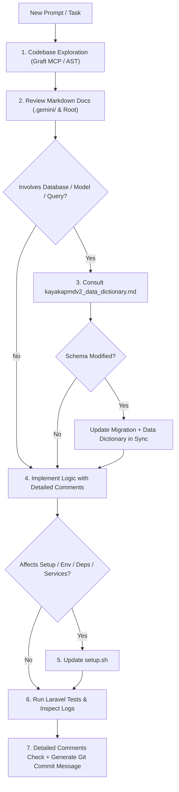

# Implementation Plan: Rules and Skills System for KayakapMD Clinic

## Goal Description
Establish a comprehensive, standardized, and enforceable operational framework across the project by creating:
1. [rules.md](file:///C:/docker/php_projects/kayakapmd_clinic/rules.md) in the project root.
2. [skills.md](file:///C:/docker/php_projects/kayakapmd_clinic/skills.md) in the project root.
3. Native Antigravity skill [.agents/skills/kayakapmd-workflow/SKILL.md](file:///C:/docker/php_projects/kayakapmd_clinic/.agents/skills/kayakapmd-workflow/SKILL.md) for progressive disclosure and automatic skill discovery.

These files enforce a mandatory 6-step lifecycle on every prompt, feature build, bugfix, and update:
1. **Explore the Codebase First Before Modifying Code** (prioritizing Graft MCP tools).
2. **Review Context & Markdown Documentation Files** across [.gemini](file:///C:/docker/php_projects/kayakapmd_clinic/.gemini) and project root before planning or making changes.
3. **Consult [.gemini/database/kayakapmdv2_data_dictionary.md](file:///C:/docker/php_projects/kayakapmd_clinic/.gemini/database/kayakapmdv2_data_dictionary.md)** as the authoritative source of truth for all database operations, querying, models, and schema definitions.
4. **Synchronize Schema Changes**: Update both [.gemini/database/kayakapmdv2_data_dictionary.md](file:///C:/docker/php_projects/kayakapmd_clinic/.gemini/database/kayakapmdv2_data_dictionary.md) and Laravel database migration files on every schema change.
5. **Maintain [setup.sh](file:///C:/docker/php_projects/kayakapmd_clinic/setup.sh)** whenever new dependencies, migrations, seeders, environment variables, or service commands are added or updated.
6. **Utilize Laravel Testing & Structured Logging** for debugging, verification, and regression prevention.
7. Incorporate user standards: Detailed comments on all code additions/modifications and a standardized Git commit message upon task completion.

---

## User Review Required

> [!NOTE]
> **Scope Decisions per User Guidance:**
> - [GEMINI.md](file:///C:/docker/php_projects/kayakapmd_clinic/GEMINI.md) and [AGENTS.md](file:///C:/docker/php_projects/kayakapmd_clinic/AGENTS.md) will **remain untouched** to preserve Graft MCP configuration.
> - An Antigravity-native skill definition will be created at [.agents/skills/kayakapmd-workflow/SKILL.md](file:///C:/docker/php_projects/kayakapmd_clinic/.agents/skills/kayakapmd-workflow/SKILL.md) in addition to root [rules.md](file:///C:/docker/php_projects/kayakapmd_clinic/rules.md) and [skills.md](file:///C:/docker/php_projects/kayakapmd_clinic/skills.md).

---

## Proposed Changes

### Project Root Documentation & Rules

---

#### [NEW] [rules.md](file:///C:/docker/php_projects/kayakapmd_clinic/rules.md)
Contains the operational rules and mandatory protocols that must be evaluated and followed prior to any modification:

1. **Rule 1: Codebase Exploration Mandate**
   - Strictly prohibit unverified blind code modifications or guesses.
   - Mandate using Graft MCP (`graft_repo_map`, `graft_find_code`, `graft_trace_calls`, `graft_file_api`) before opening files.
   - Respect architectural boundaries defined in [docs/ARCHITECTURE.md](file:///C:/docker/php_projects/kayakapmd_clinic/docs/ARCHITECTURE.md).
2. **Rule 2: Context & Markdown Documentation Review Protocol**
   - Mandatory inspection of all `.md` files in [.gemini](file:///C:/docker/php_projects/kayakapmd_clinic/.gemini) (including `database/`, `implementation plans/`, `walkthroughs/`, and `settings.json`) and project root (`README.md`, `NOTES.md`, `TODO.md`, `docs/*.md`).
   - Ground changes in previously established patterns and user notes.
3. **Rule 3: Authoritative Database Source of Truth**
   - [.gemini/database/kayakapmdv2_data_dictionary.md](file:///C:/docker/php_projects/kayakapmd_clinic/.gemini/database/kayakapmdv2_data_dictionary.md) is the authoritative source of truth for all database tables, columns, foreign relations, and legacy vs v2 (`dd_*` vs `dd_diag_*`) schemas.
   - Any query, Eloquent model, or API endpoint touching the database must verify column names and data types against this file.
4. **Rule 4: Dual-Update Schema Synchronization**
   - Every database schema change requires two simultaneous deliverables:
     1. A Laravel database migration in `database/migrations/` (with idempotent `hasTable`/`hasColumn` safeguards).
     2. Updated table/column definition in [.gemini/database/kayakapmdv2_data_dictionary.md](file:///C:/docker/php_projects/kayakapmd_clinic/.gemini/database/kayakapmdv2_data_dictionary.md).
5. **Rule 5: Environment & Setup Script (`setup.sh`) Integrity**
   - Any modification touching PHP dependencies (`composer.json`), npm dependencies (`package.json`), environment variables (`.env.example`), seeders, migration sequences, or dev server commands must be reflected in [setup.sh](file:///C:/docker/php_projects/kayakapmd_clinic/setup.sh).
   - [setup.sh](file:///C:/docker/php_projects/kayakapmd_clinic/setup.sh) must remain runnable and idempotent.
6. **Rule 6: Quality Assurance via Laravel Testing & Structured Logging**
   - All bugfixes and features must be validated using PHPUnit (`php artisan test` or `./vendor/bin/phpunit`).
   - Use Laravel `Log::info`, `Log::error`, and `Log::warning` in controllers and services; review `storage/logs/laravel.log` during debugging and testing.
7. **Rule 7: Code Commenting & Commit Standards**
   - Detailed comments on every code change and addition.
   - Conventional Git commit message generated upon task completion.

---

#### [NEW] [skills.md](file:///C:/docker/php_projects/kayakapmd_clinic/skills.md)
Provides concrete step-by-step procedures, commands, tool calls, and templates for executing each rule:

1. **Skill 1: Codebase Exploration & Graft MCP Playbook**
   - Exact workflows for `graft_repo_map`, `graft_find_code`, `graft_trace_calls`, `graft_file_api`.
2. **Skill 2: Context & Documentation Review Checklist**
   - Systematically checking [.gemini](file:///C:/docker/php_projects/kayakapmd_clinic/.gemini) subdirectories and root `.md` files.
3. **Skill 3: Data Dictionary Consultation Workflow**
   - How to search and resolve table relationships in [.gemini/database/kayakapmdv2_data_dictionary.md](file:///C:/docker/php_projects/kayakapmd_clinic/.gemini/database/kayakapmdv2_data_dictionary.md).
   - Navigating across the 15 modules and handling legacy vs v2 table variants.
4. **Skill 4: Schema Evolution & Migration Dual-Update Playbook**
   - Creating idempotent Laravel migrations and updating the Markdown tables in the data dictionary.
5. **Skill 5: `setup.sh` Maintenance & Validation Playbook**
   - Audit checklist for `setup.sh` sections when modifying dependencies, env keys, or seeders.
6. **Skill 6: Laravel Testing & Logging Diagnostics Playbook**
   - Running test suites (`php artisan test`, `phpunit`), writing tests under `tests/Feature/`, and diagnosing via `storage/logs/laravel.log`.
7. **Skill 7: Code Commenting & Git Commit Conventions**
   - Commenting standards and standardized commit message generation.

---

### Antigravity Native Skill Customization

---

#### [NEW] [.agents/skills/kayakapmd-workflow/SKILL.md](file:///C:/docker/php_projects/kayakapmd_clinic/.agents/skills/kayakapmd-workflow/SKILL.md)
Native Antigravity skill structure with YAML frontmatter:
- `name`: `kayakapmd-workflow`
- `description`: Provides standard operating procedures for KayakapMD Clinic development including codebase exploration with Graft MCP, context and docs review, database data dictionary consultation, schema dual-update sync, setup.sh integrity, Laravel testing, and structured logging.
- Contains the progressive disclosure playbook and direct links to [rules.md](file:///C:/docker/php_projects/kayakapmd_clinic/rules.md) and [skills.md](file:///C:/docker/php_projects/kayakapmd_clinic/skills.md).

---

## Verification Plan

### Automated Checks
- Verify markdown syntax and that all file links resolve correctly.
- Verify directory structure for `.agents/skills/kayakapmd-workflow/`.
- Verify [GEMINI.md](file:///C:/docker/php_projects/kayakapmd_clinic/GEMINI.md) and [AGENTS.md](file:///C:/docker/php_projects/kayakapmd_clinic/AGENTS.md) remain unmodified.

### Manual Verification
- Verify all 6 prompt requirements are fully covered in `rules.md`, `skills.md`, and the native Antigravity skill.
- Verify user global rules (detailed comments, commit message after completion) are embedded.
