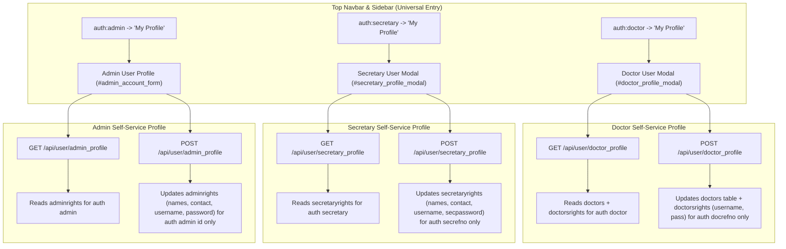

# Implementation Plan: Dedicated User Profile Pages/Modals (Doctor, Secretary, Admin), Secretary Queue Import Fix, Patients Masterlist History Modal, and Doctor Print PDF URL

## Goal Description
This plan establishes dedicated, secure **User Profile Pages / Modals** tailored specifically for each authenticated role (**Doctor**, **Secretary**, and **Admin**) on their respective dashboards, allowing each user to view and edit **ONLY their own user information, including username and password**, strictly segregated from the administrative **Users Management** module.

In addition, it resolves the three core operational issues:
1. **Secretary Queue Patient Import (500 / 404 Error Fix)**: Resolving import errors from the Queue and Masterlist tables in [`ConsultationController::fetchConsultation`](file:///C:/docker/php_projects/kayakapmd_clinic/app/Http/Controllers/ConsultationController.php).
2. **Patients Masterlist History Modal Activation**: Fixing the inert `.view-btn` history button in `#patientMasterlistModal` and resolving route shadowing on `/api/fetch_patient_medhistory`.
3. **Doctor Consultation Rx & Instructions Print Base URL**: Dynamically computing the application prefix (`/kayakapmd_clinic/print_pdf`) in [`consultation.js`](file:///C:/docker/php_projects/kayakapmd_clinic/resources/js/pages/doctor/consultation.js) and [`doctor.js`](file:///C:/docker/php_projects/kayakapmd_clinic/resources/js/doctor.js).

---

## User Review Required & Design Architecture

> [!IMPORTANT]
> **Key Architectural Distinction: User Page vs. Users Management**:
> - **Users Management** (Admin Dashboard -> Users Management -> Secretaries/Admin Users & Doctors): An administrative control panel where an administrator manages **other users** (creating new accounts, assigning doctors, deactivating, or deleting).
> - **User Page / Profile** (Admin, Secretary, and Doctor Dashboards): A self-service account panel where the currently logged-in user can **ONLY edit their own information**, specifically:
>   - **Doctor User Page**: Edits all columns from the `doctors` table (names, specialty, clinic details, licenses, rates, etc.) and credentials from `doctorsrights` (`username`, `pass`).
>   - **Secretary User Page**: Edits all fields from its source table `secretaryrights` (`secfname`, `secmname`, `seclname`, `secsuffix`, `secgender`, `secbday`, `seccontactno`, `secemail`, `secadrs`), especially `username` and `secpassword`.
>   - **Admin User Page**: Edits all fields from its source table `adminrights` (`adminfname`, `adminmname`, `adminlname`, `admincontactno`, `adminemail`), especially `username` and `password`.
> - **Zero Cross-User Tampering**: All self-service update endpoints rely exclusively on `auth()->guard(...)->user()`, ignoring any user-supplied IDs to guarantee users can only edit their own account.

---

## Database Schema & Source Table Mapping

Verified against the active database and [`.gemini/database/kayakapmdv2_data_dictionary.md`](file:///C:/docker/php_projects/kayakapmd_clinic/.gemini/database/kayakapmdv2_data_dictionary.md):

### 1. Doctor Dashboard (`doctors` Profile + `doctorsrights` Credentials)
- **Profile Table**: `doctors`
  - *Identity*: `docfname`, `docmname`, `doclname`, `suffix`, `titlename`, `docfirst`, `docname`
  - *Contact & Clinic*: `emailadd`, `cellno`, `adrs`, `clinicroom`, `clinichours`
  - *Specialty & Org*: `proftype`, `expertise`, `department`, `profgroup`, `catg`, `station`, `groupname`
  - *Licenses & Accreditations*: `tin`, `Licno`, `licnoexpiry`, `phicno`, `phicexpiry`, `phicname`, `phicenable`, `phicrate`, `S2no`, `PTR`
  - *Rates, Tax & Billing*: `pfrate`, `rodrate`, `tax`, `vatable`, `vatrate`/`VAT`, `autoAddVAT`, `coacode`, `accountno`, `issuehospOR`
  - *System & Notes*: `quevisible`, `allowtextresult`, `allowdocsystem`, `disabletext`, `otherinfo`, `biodata`
- **Credentials Table**: `doctorsrights`
  - *Authentication*: `username`, `pass` (hashed)

### 2. Secretary Dashboard (`secretaryrights` Source Table)
- **Table**: `secretaryrights`
  - *Profile*: `secfname`, `secmname`, `seclname`, `secsuffix`, `secgender`, `secbday`, `seccontactno`, `secemail`, `secadrs`, `secidno`
  - *Authentication*: `username`, `secpassword` (hashed)

### 3. Admin Dashboard (`adminrights` Source Table)
- **Table**: `adminrights`
  - *Profile*: `adminfname`, `adminmname`, `adminlname`, `admincontactno`, `adminemail`, `adminrefno`
  - *Authentication*: `username`, `password` (hashed)

---

## User-Confirmed Design Decisions
> [!NOTE]
> 1. **Doctor Profile Modal Layout**: Organized 5-tab layout:
>    - **Tab 1: Personal & Login Credentials** (`docfname`, `docmname`, `doclname`, `suffix`, `titlename`, `docfirst`, `username`, `pass`, `emailadd`, `cellno`, `adrs`)
>    - **Tab 2: Licenses & Accreditations** (`licno`, `licnoexpiry`, `phicno`, `phicexpiry`, `phicname`, `phicenable`, `phicrate`, `s2no`, `ptr`, `tin`)
>    - **Tab 3: Practice & Clinic Setup** (`proftype`, `expertise`, `department`, `profgroup`, `catg`, `clinicroom`, `clinichours`, `station`, `groupname`)
>    - **Tab 4: Rates, Tax & Billing** (`pfrate`, `rodrate`, `tax`, `vatable`, `vatrate`/`VAT`, `autoAddVAT`, `coacode`, `accountno`, `issuehospOR`)
>    - **Tab 5: System Settings & Notes** (`status`, `statusreason`, `quevisible`, `allowtextresult`, `allowdocsystem`, `disabletext`, `otherinfo`, `biodata`)
> 2. **Secretary & Admin User Pages**:
>    - Explicit badge displaying the underlying source table (`secretaryrights` and `adminrights`).
>    - Clean form allowing the user to update their personal details, login username, and optional new password.
> 3. **Navigation Access**:
>    - In top navbar ([`components/navbar.blade.php`](file:///C:/docker/php_projects/kayakapmd_clinic/resources/views/components/navbar.blade.php)), a "My Profile" button renders for each authenticated role (Doctor, Secretary, Admin).
>    - In sidebar ([`components/sidebar.blade.php`](file:///C:/docker/php_projects/kayakapmd_clinic/resources/views/components/sidebar.blade.php)), "My Profile" navigation links provide direct access.

---

## Technical Flow Diagram



---

## Proposed Changes

### Component 1: Doctor User Profile (Self-Service)
#### [MODIFY] [`resources/views/modals/doctor_info.blade.php`](file:///C:/docker/php_projects/kayakapmd_clinic/resources/views/modals/doctor_info.blade.php)
- Transform from static read-only modal into an editable self-service modal (`#doctor_profile_modal`) featuring the 5 confirmed tabs:
  - Tab 1: Personal & Login Credentials (`docfname`, `docmname`, `doclname`, `suffix`, `titlename`, `docfirst`, `username`, `new_password`, `emailadd`, `cellno`, `adrs`).
  - Tab 2: Licenses & Accreditations (`licno`, `licnoexpiry`, `phicno`, `phicexpiry`, `phicname`, `phicenable`, `phicrate`, `s2no`, `ptr`, `tin`).
  - Tab 3: Practice & Clinic (`proftype`, `expertise`, `department`, `profgroup`, `catg`, `clinicroom`, `clinichours`, `station`, `groupname`).
  - Tab 4: Rates, Tax & Billing (`pfrate`, `rodrate`, `tax`, `vatable`, `vatrate`, `autoAddVAT`, `coacode`, `accountno`, `issuehospOR`).
  - Tab 5: System Settings & Notes (`quevisible`, `allowtextresult`, `allowdocsystem`, `disabletext`, `otherinfo`, `biodata`).
- Include "Save Profile" button (`#save_doctor_profile_btn`).

#### [MODIFY] [`app/Http/Controllers/DoctorController.php`](file:///C:/docker/php_projects/kayakapmd_clinic/app/Http/Controllers/DoctorController.php)
- In `fetchDoctorUser`: Return full `DoctorsProfileModel` record merged with `doctorsrights` (`username`, `taxpercent`, `bankacct`).
- Add `updateDoctorProfile(Request $request)`:
  - Guarded by `auth:doctor`.
  - Resolves `$doctorAuth = auth()->guard('doctor')->user()`.
  - Validates `username` (unique in `doctorsrights` except current doctor), `emailadd`, and optional `new_password`.
  - Updates all `doctors` table columns for `docrefno == $doctorAuth->docrefno`.
  - Updates `doctorsrights` credentials: `username`, and if `new_password` is provided, `pass = Hash::make($request->new_password)`.
  - Logs action: `Log::info('Doctor updated own profile', ['docrefno' => $doctorAuth->docrefno])`.

#### [MODIFY] [`resources/js/doctor.js`](file:///C:/docker/php_projects/kayakapmd_clinic/resources/js/doctor.js) & [`resources/js/pages/doctor/consultation.js`](file:///C:/docker/php_projects/kayakapmd_clinic/resources/js/pages/doctor/consultation.js)
- Handle `#doctor_profile_modal` opening: populate all 5 tabs with existing data from `fetch_doctor_data`.
- Attach submit handler to `#save_doctor_profile_btn` making AJAX request to `/api/doctor/update_profile`.

---

### Component 2: Secretary User Profile (Self-Service)
#### [NEW] [`resources/views/modals/secretary_profile.blade.php`](file:///C:/docker/php_projects/kayakapmd_clinic/resources/views/modals/secretary_profile.blade.php)
- Create a dedicated modal `#secretary_profile_modal`:
  - Title: `<i class="fa-solid fa-user-nurse"></i> My Profile <span class="badge bg-info bg-opacity-25 text-info font-monospace small ms-2">table: secretaryrights</span>`
  - Form `#secretary_profile_form`:
    - First Name (`secfname`), Middle Name (`secmname`), Last Name (`seclname`), Suffix (`secsuffix`), Sex (`secgender`), Birthday (`secbday`).
    - Username (`username`), New Password (`secpassword` - optional).
    - Contact # (`seccontactno`), Email (`secemail`), Address (`secadrs`).
  - Action button: "Save Profile" (`#save_secretary_profile_btn`).

#### [MODIFY] [`resources/views/modals/secretary_management.blade.php`](file:///C:/docker/php_projects/kayakapmd_clinic/resources/views/modals/secretary_management.blade.php)
- Update Account tab to allow editing full personal details, `username`, and `secpassword`.

#### [MODIFY] [`app/Http/Controllers/SecretaryController.php`](file:///C:/docker/php_projects/kayakapmd_clinic/app/Http/Controllers/SecretaryController.php)
- In `fetchSecretary`: Return authenticated secretary model from `auth()->guard('secretary')->user()`.
- Add `updateSecretaryProfile(Request $request)`:
  - Guarded by `auth:secretary`.
  - Resolves `$secAuth = auth()->guard('secretary')->user()`.
  - Validates `username` (unique in `secretaryrights` except current secretary), `secemail`, and optional `secpassword`.
  - Updates `secretaryrights` table columns: `secfname`, `secmname`, `seclname`, `secsuffix`, `secgender`, `secbday`, `seccontactno`, `secemail`, `secadrs`, `username`.
  - If `secpassword` is filled: `secpassword = Hash::make($request->secpassword)`.
  - Logs action: `Log::info('Secretary updated own profile', ['secrefno' => $secAuth->secrefno])`.

#### [MODIFY] [`resources/js/secretary-management.js`](file:///C:/docker/php_projects/kayakapmd_clinic/resources/js/secretary-management.js)
- Wire up `#save_secretary_profile_btn` to send AJAX request to `/api/secretary/update_profile`.

---

### Component 3: Admin User Profile (Self-Service)
#### [MODIFY] [`resources/views/pages/admin/profile.blade.php`](file:///C:/docker/php_projects/kayakapmd_clinic/resources/views/pages/admin/profile.blade.php)
- Update the "Administrator Account" section:
  - Add subtitle badge: `<span class="badge bg-primary bg-opacity-25 text-primary font-monospace small ms-2">table: adminrights</span>`
  - Ensure all `adminrights` fields are editable: `adminfname`, `adminmname`, `adminlname`, `admincontactno`, `adminemail`, `username`, and `password` (new password).
- Wire submit button `#save_admin_account` to `/api/admin/update_profile`.

#### [MODIFY] [`app/Http/Controllers/ManagementController.php`](file:///C:/docker/php_projects/kayakapmd_clinic/app/Http/Controllers/ManagementController.php)
- Add `updateAdminProfile(Request $request)`:
  - Guarded by `auth:admin`.
  - Resolves `$adminAuth = auth()->guard('admin')->user()`.
  - Validates `username` (unique in `adminrights` except current admin), `adminemail`, and optional `password`.
  - Updates `adminrights` for `id == $adminAuth->id`: `adminfname`, `adminmname`, `adminlname`, `admincontactno`, `adminemail`, `username`.
  - If `password` is filled: `password = Hash::make($request->password)`.
  - Logs action: `Log::info('Admin updated own profile', ['adminrefno' => $adminAuth->adminrefno])`.

---

### Component 4: Universal Navigation Updates
#### [MODIFY] [`resources/views/components/navbar.blade.php`](file:///C:/docker/php_projects/kayakapmd_clinic/resources/views/components/navbar.blade.php)
- Add "My Profile" button for each authenticated role:
  ```blade
  @if (auth()->guard('doctor')->check())
      <button class="btn btn-light" data-bs-toggle="modal" data-bs-target="#doctor_profile_modal">
          <i class="fa-solid fa-user-doctor"></i> My Profile
      </button>
  @elseif (auth()->guard('secretary')->check())
      <button class="btn btn-light" data-bs-toggle="modal" data-bs-target="#secretary_profile_modal">
          <i class="fa-solid fa-user-nurse"></i> My Profile
      </button>
  @elseif (auth()->guard('admin')->check())
      <a class="btn btn-light" href="{{ route('admin.profile') }}">
          <i class="fa-solid fa-user-shield"></i> My Profile
      </a>
  @endif
  ```

#### [MODIFY] [`resources/views/components/sidebar.blade.php`](file:///C:/docker/php_projects/kayakapmd_clinic/resources/views/components/sidebar.blade.php)
- Add "My Profile" link for Secretary and Doctor sidebars.

---

### Component 5: Secretary Queue Import Fix (500 / 404)
#### [MODIFY] [`resources/js/pages/secretary/queue.js`](file:///C:/docker/php_projects/kayakapmd_clinic/resources/js/pages/secretary/queue.js)
- Fix Masterlist Import button to pass `consultationrefno: row.consultationrefno` and `pxrefno: row.pxrefno` instead of `row.casecode`.
- Guard all date splitting: `(p.consultation_date ? p.consultation_date.split(" ")[0] : "")`.
- Ensure `#patientMasterlistModal` cleanly hides when an import action is confirmed.

#### [MODIFY] [`app/Http/Controllers/ConsultationController.php`](file:///C:/docker/php_projects/kayakapmd_clinic/app/Http/Controllers/ConsultationController.php)
- In `fetchPxMasterlist`: Include `pxmasterlist.casecode` in the select clause.
- In `fetchConsultation`:
  - Support multi-key lookup: `consultationrefno`, `pxrefno`, `casecode`.
  - If no walk-in consultation exists, fetch masterlist patient data from `pxmasterlist` to allow prefilling new consultations.
  - Wrap in `try...catch (\Throwable $e)` with `Log::error` to prevent raw 500 error responses.

---

### Component 6: Patients Masterlist History Modal Activation
#### [MODIFY] [`routes/api.php`](file:///C:/docker/php_projects/kayakapmd_clinic/routes/api.php)
- Register dedicated route `Route::post('fetch_patient_medhistory', [SecretaryController::class, 'fetchPatientMedhistory'])` under `auth:secretary,admin`.

#### [MODIFY] [`resources/js/pages/secretary/queue.js`](file:///C:/docker/php_projects/kayakapmd_clinic/resources/js/pages/secretary/queue.js)
- Attach delegated click handler on `.view-btn` within `#patientMasterlistModal`:
  - Capture `pxrefno` and `consultationrefno`.
  - Hide `#patientMasterlistModal` and show `#patientMedhistoryModal`.
  - Call `/api/fetch_patient_medhistory` via AJAX.
  - Populate patient history table and previous diagnoses.
  - Handle back-navigation to return cleanly to `#patientMasterlistModal`.

#### [MODIFY] [`resources/views/layouts/app.blade.php`](file:///C:/docker/php_projects/kayakapmd_clinic/resources/views/layouts/app.blade.php) & [`resources/views/modals/patient_masterlist.blade.php`](file:///C:/docker/php_projects/kayakapmd_clinic/resources/views/modals/patient_masterlist.blade.php)
- Ensure `#patientMedhistoryModal` is included in `@push('modals')` on the secretary queue view.

---

### Component 7: Doctor Consultation Rx & Instructions Print Base URL
#### [MODIFY] [`resources/js/pages/doctor/consultation.js`](file:///C:/docker/php_projects/kayakapmd_clinic/resources/js/pages/doctor/consultation.js) & [`resources/js/doctor.js`](file:///C:/docker/php_projects/kayakapmd_clinic/resources/js/doctor.js)
- Compute dynamic base URL:
  ```javascript
  const appBaseUrl = window.location.pathname.startsWith('/kayakapmd_clinic') 
      ? `${window.location.origin}/kayakapmd_clinic` 
      : window.location.origin;
  $("#print_rx_btn").attr("href", `${appBaseUrl}/print_pdf?type=rx&consultationrefno=${selected_consultation}`);
  $("#print_instruction_btn").attr("href", `${appBaseUrl}/print_pdf?type=instructions&consultationrefno=${selected_consultation}`);
  ```

---

## Verification Plan

### 1. Automated Tests
Run the test suite inside Docker:
```powershell
docker exec -w /var/www/html/kayakapmd_clinic latest_php_server php artisan test
```

### 2. Asset Compilation
Compile Vite assets on host:
```powershell
npm run build
```

### 3. Manual Verification Checklist
- **Doctor Self-Service User Page**:
  - Login as doctor. Click "My Profile" in navbar.
  - Verify 5-tab modal loads doctor's actual profile from `doctors` and username from `doctorsrights`.
  - Edit fields and change username/password. Save and verify database update.
  - Verify doctor CANNOT edit any other doctor's profile.
- **Secretary Self-Service User Page**:
  - Login as secretary. Click "My Profile" in navbar.
  - Verify modal displays `secretaryrights` source table and loads secretary's details.
  - Edit personal details, username, and password. Save and verify database update.
- **Admin Self-Service User Page**:
  - Login as admin. Go to "My Profile".
  - Verify "Administrator Account" displays `adminrights` badge and allows editing admin's own username and password.
- **Secretary Queue Import Fix**:
  - Open Queue page. Import patient from Unscheduled queue and from Masterlist modal.
  - Verify 200 OK response and consultation form is pre-filled without errors.
- **Masterlist History Modal**:
  - In Masterlist modal, click "History" on a patient row.
  - Verify `#patientMedhistoryModal` opens, loads history from `/api/fetch_patient_medhistory`, and back-navigation works.
- **Doctor Print URL**:
  - In Doctor Consultation, verify Rx & Instruction print links resolve to `http://localhost:10000/kayakapmd_clinic/print_pdf?...`.
