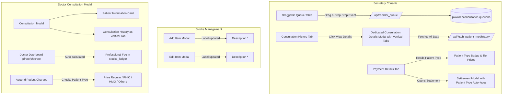

# Implementation Plan: Secretary Console, Stocks Management & Doctor Consultation Enhancements

## Goal Description
Enhance key clinical and administrative workflows across three modules in **KayakapMD Clinic**:
1. **Secretary Console**:
   - Change the "Medical History" tab label to "Consultation History".
   - Provide a dedicated **"View Details" modal** presenting all tabs and data from the consultation modal (Patient Information/Vitals, Consultation History, Impressions & Diagnosis, Rx & Instructions, Diagnostic Requests, Radiology & Laboratory, and Patient Charges).
   - Ensure queue numbers (`queueno`) are always reliably saved and preserved upon record creation, updates, and rescheduling.
   - Make the queue table (`#patients_queue_table`) draggable with immediate automatic database persistence upon row drop.
   - Ensure payments on the Payment Details tab and settlements refer to the patient type (`REGULAR`, `PHIC`, `HMO`, `OTHERS`).
2. **Stocks Management**:
   - Change the "Name" field label to "Description" in both Add Item and Edit Item modals and adjust corresponding form validations.
3. **Doctor's Consultation Modal**:
   - Convert the patient information section from a collapsed accordion into a clean, always-visible Bootstrap card.
   - Update "Medical History" tab label to "Consultation History" as a vertical tab.
   - Calculate the consultation fee dynamically from the doctor's dashboard rate (`pfrate` / `phicrate`).
   - Ensure patient charges in the consultation modal differ based on the patient type (Regular, PHIC, HMO, Others).

---

## User Decisions Incorporated

- **Consultation History Data Viewer**: A dedicated "View Details" modal in the Secretary Console featuring the vertical tabs layout identical to the doctor's consultation modal.
- **Vertical Tabs in Consultation Modal**: The consultation modal's first vertical tab is updated from "Medical History" to "Consultation History".
- **Draggable Queue Reordering**: Automatic real-time persistence of the new queue sequence immediately upon row drop via `/api/reorder_queue`.

---

## Proposed Changes



---

### Component 1: Secretary Console

#### [MODIFY] `resources/views/pages/secretary/queue.blade.php`
- Change tab button label from "Medical History" to "Consultation History" (id `#patient_medhistory_tab_btn`).
- Update tab pane title to "Patient Consultation History".
- Update `#sec_medhistory_table` to include an "Action" column with a "View" button for each record.
- Add drag handle `<i class="fa-solid fa-grip-vertical drag-handle">` and draggable cursor styles to `#patients_queue_table`.
- In `#payment_info` (Payment Details tab), add a prominent `Patient Type: REGULAR / PHIC / HMO` badge header (`#pay_tab_patient_type_badge`).
- Include the new consultation details modal component (`@include('modals.view_consultation_details')`).

#### [NEW] `resources/views/modals/view_consultation_details.blade.php`
- Dedicated viewer modal displaying all vertical tabs from the consultation modal:
  1. Patient Demographics & Vitals at time of consultation (BP, Temp, Pulse, Resp Rate, Weight, Height).
  2. Vertical Navigation Tabs:
     - Consultation History (previous consultations of patient)
     - Impressions & Diagnosis (Chief Complaints, Impressions, Diagnosis, Admission instructions)
     - Rx & Instructions (prescriptions list with sig, instructions)
     - Diagnostic Requests (ordered laboratory & imaging procedures)
     - Radiology & Laboratory (uploaded files with preview/download)
     - Patient Charges (itemized bill, rates, and totals)

#### [MODIFY] `resources/js/pages/secretary/queue.js`
- Initialize jQuery UI Sortable on `#patients_queue_table tbody` with drag handle selector `.drag-handle`.
- On sort stop / update event:
  - Re-index visual queue numbers (`001`, `002`, `003`...).
  - Extract the new sequence of `consultationrefno`s.
  - Automatically persist the new queue order via AJAX `POST /api/reorder_queue`.
  - Display a brief toast confirming queue order updated.
- Update `loadSecretaryMedhistory` to render the "View" action button for each consultation row.
- Attach click handler to `.view-consultation-history-btn` to populate and show `#view_consultation_details_modal`.
- In `loadPatientCharges`:
  - Display the patient type in `#pay_tab_patient_type_badge`.
  - Pass patient type when fetching prices and appending charges.
- In `#settlement_btn` click handler:
  - If patient is PHIC: highlight and auto-focus PHIC channel.
  - If patient is HMO: highlight HMO channel and preselect HMO company in `#hmo_type`.
  - If patient is REGULAR: highlight and focus Cash/CTA.

#### [MODIFY] `app/Http/Controllers/ConsultationController.php`
- In `saveConsultation`:
  - Fix queue count calculation: remove flawed `whereTime` matching and query active count for target doctor and date.
  - Save `classification` from `$request->patient_type` to `pxwalkinconsultation` and `pxmasterlist`.
  - Ensure `queueno` is always assigned sequentially without gaps.
- In `updateConsultation`:
  - Save `classification` from `$request->patient_type`.
  - Preserve or assign `queueno` reliably.
- Add `reorderQueue(Request $request)` method:
  - Accepts an array of `{ consultationrefno, queueno }`.
  - Updates `queueno` in `pxwalkinconsultation` within a DB transaction.

#### [MODIFY] `app/Http/Controllers/SecretaryController.php`
- In `fetchPatientMedhistory`:
  - Enhance returned data to include all consultation details (vital signs, impression, diagnosis, foradmit, foradmit_instructions, photo_path, radiologypath, laboratorypath, doctor details).
  - Also fetch and attach associated Prescriptions (Rx) from `stocks_ledger` and Diagnostic Requests from `stocks_ledger` / `dd_diag_*`.

#### [MODIFY] `routes/api.php`
- Add route `POST /api/reorder_queue` pointing to `ConsultationController::reorderQueue`.

---

### Component 2: Stocks Management

#### [MODIFY] `resources/views/modals/admin/add_item.blade.php`
- Change `<label ... for="item_dscr">Name <span class="text-danger">*</span></label>` to `<label ... for="item_dscr">Description <span class="text-danger">*</span></label>`.
- Update input placeholder to `placeholder="Item or Service Description"`.

#### [MODIFY] `resources/views/modals/admin/edit_item.blade.php`
- Change `<label ... for="eitem_dscr">Name <span class="text-danger">*</span></label>` to `<label ... for="eitem_dscr">Description <span class="text-danger">*</span></label>`.
- Update input placeholder to `placeholder="Item or Service Description"`.

#### [MODIFY] `resources/js/pages/admin/stocks/stock_management.js`
- Update validation alert text from `"Item Name is required."` to `"Item Description is required."`.
- Keep field names intact (`item_dscr`, `eitem_dscr`) for database compatibility.

---

### Component 3: Doctor's Consultation Modal

#### [MODIFY] `resources/views/modals/consultation_modal.blade.php`
- Replace accordion `#consultation_accordion` and button `#rx_patient_info` with a standalone Bootstrap card:
  ```html
  <div class="card border shadow-sm mb-3">
      <div class="card-header bg-light py-2 d-flex justify-content-between align-items-center">
          <span class="fw-bold text-dark"><i class="fa-solid fa-user me-2 text-primary"></i> Patient Information</span>
          <span class="badge bg-secondary" id="doctor_modal_patient_type_badge">REGULAR</span>
      </div>
      <div class="card-body p-3">
          <!-- Always-visible Demographics, Contacts, and Vital Signs -->
      </div>
  </div>
  ```
- In the vertical navigation pills (`.nav.nav-pills.d-flex.flex-column`):
  - Rename tab `#medhistory_btn` label to `<i class="fa-solid fa-clock-rotate-left me-2"></i> Consultation History`.
  - Update pane header to `<h4>Consultation History</h4>`.

#### [MODIFY] `app/Http/Controllers/DoctorController.php`
- In `fetchPatientCharges`:
  - Retrieve the assigned doctor's consultation fee from `DoctorsProfileModel` (`pfrate` or `phicrate`).
  - If no `PROFESSIONAL FEE` record exists in `stocks_ledger` for this consultation, automatically generate it so the consultation fee calculated from the doctor's dashboard is always populated.
- In `getHmoPrice`:
  - Enhance logic to differentiate patient charges by patient type:
    - `phic`: `price_phic` (fallback `price_regular`)
    - `hmo`: `price_hmo` (fallback `price_regular`)
    - `others`: `price_others` (fallback `price_regular`)
    - `regular`: `price_regular`
- In `saveAppendedCharges`:
  - Fall back to the patient-type-specific price if input amount is not manually overridden.

#### [MODIFY] `resources/js/pages/doctor/consultation/form.js`
- Display the patient type badge `#doctor_modal_patient_type_badge` in the Patient Information card.
- In `#search_charge` Select2 handler, request tier prices using the consultation's patient type.

---

## Verification Plan

### Automated Tests
Run Laravel test suites to confirm zero regressions and verify new functionality:
```bash
php artisan test --filter=DoctorSecretaryConsoleTest
php artisan test --filter=PatientManagementAndPrintFixesTest
php artisan test --filter=AdminProtectionStocksAndQueueTest
```
Add new feature tests in `tests/Feature/ConsultationEnhancementsTest.php`:
- Verify queue reordering endpoint `/api/reorder_queue` updates `queueno` sequentially.
- Verify `fetch_patient_medhistory` returns all consultation modal fields.
- Verify `get_hmo_price` (or charge price endpoint) returns `price_phic` for PHIC and `price_hmo` for HMO.
- Verify consultation fee auto-populates in charges based on doctor profile `pfrate`.

### Manual Verification
1. **Secretary Console**:
   - Check tab label displays "Consultation History".
   - Open Consultation History, click "View" on any record, and confirm all consultation data (vitals, diagnoses, Rx, lab/rad, charges) displays properly in the dedicated View Details modal with vertical tabs.
   - Drag and drop queue rows in `#patients_queue_table`, reload page, and confirm queue order and queue numbers (`001`, `002`...) persist immediately.
   - Switch to Payment Details tab, confirm Patient Type badge shows, append a charge, and confirm the price matches patient type.
   - Open Settlements modal, confirm appropriate channel is focused/selected for patient type.
2. **Stocks Management**:
   - Open Add Item modal, confirm label is "Description *".
   - Open Edit Item modal, confirm label is "Description *".
   - Test empty submission, confirm validation alerts "Item Description is required.".
3. **Doctor's Consultation Modal**:
   - Open consultation modal, verify Patient Information is displayed directly in a card (no accordion clicking required).
   - Verify vertical tab is labeled "Consultation History".
   - Check Patient Charges tab, verify Professional Fee / Consultation Fee is automatically calculated from doctor's dashboard configuration.
   - Append a charge for a PHIC or HMO patient, verify unit price defaults to PHIC or HMO tier price.
