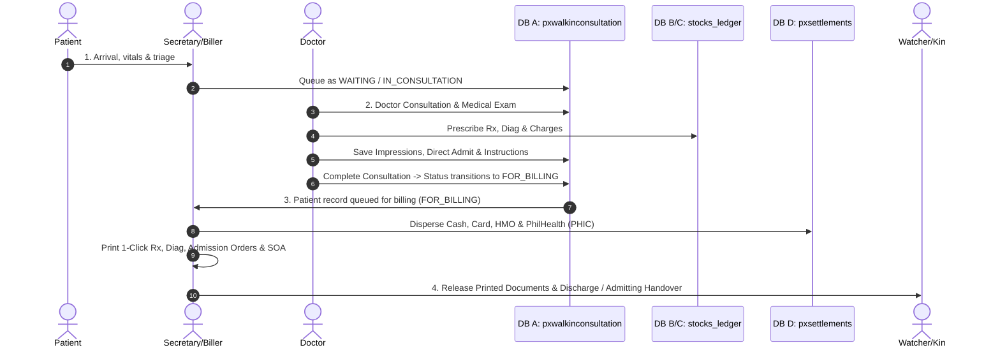

# Walkthrough: OPD Consultation End-to-End Workflow Implementation

**Date:** September 20, 2026  
**Status:** Complete & Verified  
**Reference Document:** [`.gemini/Opd consultation workflow.md`](file:///C:/docker/php_projects/kayakapmd_clinic/.gemini/Opd%20consultation%20workflow.md)  
**Implementation Plan:** [`.gemini/implementation plans/opd_consultation_workflow_plan.md`](file:///C:/docker/php_projects/kayakapmd_clinic/.gemini/implementation%20plans/opd_consultation_workflow_plan.md)

---

## 1. Overview of Changes

The outpatient department consultation workflow across all 4 actors (OPD Patient, Doctor, Secretary/Biller, Patient/Watcher) and 4 data stores (Database A: `pxwalkinconsultation`, Database B: `stocks_ledger` / `pxrxdocuments`, Database C: `stocks_ledger` / `dd_docrequests`, Database D: `pxsettlements` / `pxcharges`) has been fully harmonized and completed.



---

## 2. Key Components Implemented

### A. Schema Dual-Update (Rule 4)
1. **Migration:** Created idempotent database migration [`database/migrations/2026_09_20_110000_add_for_billing_status_to_pxwalkinconsultation_table.php`](file:///C:/docker/php_projects/kayakapmd_clinic/database/migrations/2026_09_20_110000_add_for_billing_status_to_pxwalkinconsultation_table.php) expanding `status` ENUM to include `FOR_BILLING`.
2. **Data Dictionary:** Updated [`.gemini/database/kayakapmdv2_data_dictionary.md`](file:///C:/docker/php_projects/kayakapmd_clinic/.gemini/database/kayakapmdv2_data_dictionary.md) line 632 documenting `FOR_BILLING`.
3. **Model & Validation:** Updated [`app/Models/ConsultationModel.php`](file:///C:/docker/php_projects/kayakapmd_clinic/app/Models/ConsultationModel.php) and [`app/Http/Controllers/ConsultationController.php`](file:///C:/docker/php_projects/kayakapmd_clinic/app/Http/Controllers/ConsultationController.php) queue validation to support `FOR_BILLING`.

### B. Doctor Check-up & Direct Admission Orders
1. **Model Fillables:** Added `'instructions'`, `'foradmit'`, `'foradmit_instructions'` to `$fillable` in [`app/Models/ConsultationModel.php`](file:///C:/docker/php_projects/kayakapmd_clinic/app/Models/ConsultationModel.php).
2. **Doctor UI:** Added `#foradmit` toggle and `#foradmit_instructions` textarea in [`resources/views/modals/consultation_modal.blade.php`](file:///C:/docker/php_projects/kayakapmd_clinic/resources/views/modals/consultation_modal.blade.php) under Impressions & Diagnosis. Added `#print_admit_btn` with Print Admission Orders action.
3. **Doctor Controller:**
   - [`app/Http/Controllers/DoctorController.php`](file:///C:/docker/php_projects/kayakapmd_clinic/app/Http/Controllers/DoctorController.php): `saveImpressionsDiagnosis` saves `foradmit` (0/1) and `foradmit_instructions`.
   - `completeConsultation` sets `status = "FOR_BILLING"` to hand off the consultation back to the Secretary desk.

### C. Secretary Queue & Billing / Settlement Enhancements
1. **Broken Route Fix:** Replaced nonexistent `/api/delete_charge_doctor` with registered route `/api/delete_patient_charge` in [`resources/js/pages/secretary/queue.js`](file:///C:/docker/php_projects/kayakapmd_clinic/resources/js/pages/secretary/queue.js) line 1042.
2. **PhilHealth (PHIC) Deduction:**
   - Updated [`resources/views/modals/settlement_modal.blade.php`](file:///C:/docker/php_projects/kayakapmd_clinic/resources/views/modals/settlement_modal.blade.php): replaced dummy `--:--` field with `#phic` PhilHealth input, and added `#info_phic` read-only display.
   - Updated [`app/Models/SettlementsModel.php`](file:///C:/docker/php_projects/kayakapmd_clinic/app/Models/SettlementsModel.php): added `phic` to `$fillable`, `$appends`, and mutator/accessor mapped to `less_phic`.
   - Updated [`app/Http/Controllers/SecretaryController.php`](file:///C:/docker/php_projects/kayakapmd_clinic/app/Http/Controllers/SecretaryController.php): `saveSettlements` aggregates categorized totals from `stocks_ledger` (`item_grouping`: `DRUGS AND MEDS`, `DIAGNOSTIC`, `PROFESSIONAL FEE`, `PROCEDURES`, `SUPPLIES`, `VACCINES`, `IMMUNIZATION`) and records `less_phic`, `less_hmo`, `net_payable`, and `transactionrefno`.
3. **1-Click Printable Documents on Secretary Queue:**
   - Added dropdown menu in [`resources/views/pages/secretary/queue.blade.php`](file:///C:/docker/php_projects/kayakapmd_clinic/resources/views/pages/secretary/queue.blade.php) with:
     - **Prescription (Rx)** (`#sec_print_rx_btn`)
     - **Diagnostic Request** (`#sec_print_diag_btn`)
     - **Admission Orders & Kin Instructions** (`#sec_print_admit_btn`)
     - **Statement of Account (SOA)** (`#sec_print_soa_btn`)
   - [`resources/js/pages/secretary/queue.js`](file:///C:/docker/php_projects/kayakapmd_clinic/resources/js/pages/secretary/queue.js) dynamically binds the active `consultationrefno` to all four URLs upon selecting/importing a patient.

### D. Printable PDF Document Templates
- [`resources/views/printables/rx_print.blade.php`](file:///C:/docker/php_projects/kayakapmd_clinic/resources/views/printables/rx_print.blade.php):
  - Added `@elseif ($type === "admission")` rendering **ADMISSION ORDERS & INSTRUCTIONS TO KIN** complete with clinical impression, direct admission badge, watcher instructions, and attending physician signature.
  - Added `@elseif ($type === "soa")` rendering **STATEMENT OF ACCOUNT (OUTPATIENT BILLING SLIP)** with itemized charge rows, unit prices, subtotal gross, PHIC deduction, HMO coverage, net amount payable, and billing/cashier signature footer.

---

## 3. Automated Test Verification (Rule 6)

A feature test suite [`tests/Feature/OpdConsultationWorkflowTest.php`](file:///C:/docker/php_projects/kayakapmd_clinic/tests/Feature/OpdConsultationWorkflowTest.php) was written and executed in the Docker environment (`latest_php_server`):

```bash
docker exec -w /var/www/html/kayakapmd_clinic latest_php_server php artisan test --filter=OpdConsultationWorkflowTest
```

### Test Results:
```text
   PASS  Tests\Feature\OpdConsultationWorkflowTest
  ✓ doctor saves impressions diagnosis and admission orders              7.76s  
  ✓ doctor completes consultation transitions queue status to for billi… 1.41s  
  ✓ secretary saves settlement with phic and hmo deductions              1.35s  
  ✓ secretary removes charge via delete patient charge                   1.32s  
  ✓ pdf printable endpoints stream successfully                          1.86s  

  Tests:    5 passed (31 assertions)
  Duration: 15.03s
```

Existing feature tests were also verified:
```bash
docker exec -w /var/www/html/kayakapmd_clinic latest_php_server php artisan test --filter=ConsultationChargesAndSettlementsTest
```
```text
   PASS  Tests\Feature\ConsultationChargesAndSettlementsTest
  ✓ unscheduled patients table excludes scheduled patients               7.85s  
  ✓ patient charges include prescribed drugs and meds                    1.36s  
  ✓ settlements save fetch and hmo population                            1.34s  

  Tests:    3 passed (20 assertions)
  Duration: 11.85s
```

Frontend assets built cleanly with Vite:
```bash
npm.cmd run build
✓ 112 modules transformed.
✓ built in 3.38s
```

Setup script syntax check passed:
```bash
bash -n setup.sh
```
