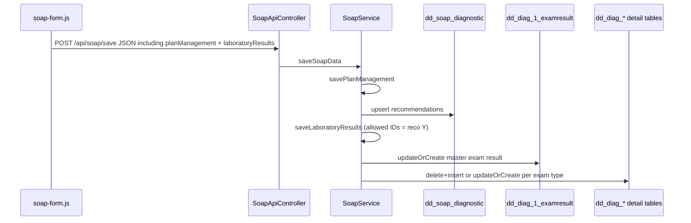

# Laboratory results: save, filter, and load

## Current state (gaps)

- Save payload in `[resources/js/pages/admin/philhealth/soap-form.js](resources/js/pages/admin/philhealth/soap-form.js)` only merges `soapClientProfileForm`, `assessmentDiagnosisForm`, `subjectiveHistoryForm`, `objectivePhysicalExaminationForm`, and `planManagementForm`. The lab form `#laboratoryResults` from `[resources/views/components/yakap-management/soap-tabs/laboratory-results.blade.php](resources/views/components/yakap-management/soap-tabs/laboratory-results.blade.php)` is never sent.
- `[app/Services/YakapManagement/SoapService.php](app/Services/YakapManagement/SoapService.php)` already saves doctor recommendations to `[dd_soap_diagnostic](app/Models/Soaps/SoapDiagnosticModel.php)` in `savePlanManagement()` (keys like `diagnostic_doctor_reco[1]` → `dDiagnosticId`, `dIsPhysicianRecommend`).
- `[app/Http/Requests/SoapPostRequest.php](app/Http/Requests/SoapPostRequest.php)` has no `laboratoryResults` rules.
- `[resources/js/pages/admin/philhealth/soap-edit.js](resources/js/pages/admin/philhealth/soap-edit.js)` populates Plan/Management from `data.diagnostics` but does not populate or toggle the Laboratory tab.
- Eloquent models for each result table already exist under `[app/Models/DiagExamResults/](app/Models/DiagExamResults/)` (e.g. `[DiagCbcModel](app/Models/DiagExamResults/DiagCbcModel.php)`); schema reference: `[docs/sample-files/diag.sql](docs/sample-files/diag.sql)`.

## Diagnostic ID → table mapping (from lab blade section titles)

Use this single source of truth in PHP (and optionally document in code comments only):

| ID  | Exam          | Table                   |
| --- | ------------- | ----------------------- |
| 1   | CBC           | `dd_diag_cbc`           |
| 2   | Urinalysis    | `dd_diag_urinalysis`    |
| 3   | Fecalysis     | `dd_diag_fecalysis`     |
| 4   | Chest X-Ray   | `dd_diag_chestxray`     |
| 5   | Sputum        | `dd_diag_sputum`        |
| 6   | Lipid Profile | `dd_diag_lipidprofile`  |
| 7   | FBS           | `dd_diag_fbs`           |
| 8   | Creatinine    | `dd_diag_creatine`      |
| 9   | ECG           | `dd_diag_ecg`           |
| 13  | Pap Smear     | `dd_diag_papsmear`      |
| 14  | OGTT          | `dd_diag_ogtt`          |
| 15  | FOBT          | `dd_diag_fobt`          |
| 17  | PPD           | `dd_diag_ppdtest`       |
| 18  | HbA1c         | `dd_diag_hba1c`         |
| 19  | RBS           | `dd_diag_rbs`           |
| 99  | Others        | `dd_diag_otherdiagexam` |

Master row: `[dd_diag_1_examresult](app/Models/DiagExamResult.php)` (one row per `en_CaseNo` + `s_TransNo`, FK to enlistment and SOAP per `diag.sql`).

## Architecture (data flow)

## Implementation steps

### 1) Frontend: include lab data in save

- In `[soap-form.js](resources/js/pages/admin/philhealth/soap-form.js)`, add `laboratoryResults: document.getElementById('laboratoryResults')` to the `forms` map so `FormData` flattens `diagnostic_{id}_*` fields into `combined.laboratoryResults` (same `setNested` pattern as other tabs).
- Guard: if the form element is missing, skip (no behavior change elsewhere).

### 2) Frontend: show only doctor-recommended panels

- In `[laboratory-results.blade.php](resources/views/components/yakap-management/soap-tabs/laboratory-results.blade.php)`, wrap each exam `card` (or equivalent block) in a container with a stable attribute, e.g. `data-philhealth-diagnostic-id="1"` … `"99"`.
- In `[soap-form.js](resources/js/pages/admin/philhealth/soap-form.js)` or `[soap-edit.js](resources/js/pages/admin/philhealth/soap-edit.js)`, add a small function `syncLaboratoryPanelsVisibility()` that:
  - Shows a panel when `input[name="diagnostic_doctor_reco[ID]"][value="Y"]` is checked inside `#soap-details-modal` (or `#planManagementForm`).
  - Hides when not `Y` (including “Deselect” / no selection), so users only see exams the doctor recommended.
- Call `syncLaboratoryPanelsVisibility()` when the SOAP modal opens and on `change` for plan-management diagnostic radios (event delegation on the modal). This covers both **new** SOAP (no DB row yet) and **loaded** SOAP.

### 3) Frontend: populate lab fields when loading a consultation

- Extend `[SoapService::getSoapDetails](app/Services/YakapManagement/SoapService.php)` (or the controller that shapes the JSON) to attach saved lab data for the SOAP’s `s_TransNo`, e.g. `labResults` with one sub-key per exam type or per diagnostic ID—keep the shape easy for the UI to loop.
- In `[soap-edit.js](resources/js/pages/admin/philhealth/soap-edit.js)`, add `populateLaboratoryTab(labResults)` that sets inputs by matching DB columns back to existing `name="diagnostic_*"` fields (mirror the inverse of the PHP mapper). Invoke it from `fetchAndPopulateSoapForm` after `populatePlanManagementTab`, then call `syncLaboratoryPanelsVisibility()`.
- Date fields: normalize stored `Y-m-d` to whatever the form expects (likely `mm/dd/yyyy` placeholders in the blade) for display only.

### 4) Backend: validation

- Add `laboratoryResults` as `nullable|array` to `[SoapPostRequest](app/Http/Requests/SoapPostRequest.php)`. Avoid enumerating every dynamic field; optional follow-up: `after` validation hook to reject unknown keys or run stricter per-ID rules once mapping exists.

### 5) Backend: persistence service

- Add a dedicated class under `App\Services\YakapManagement\` (e.g. `LaboratoryResultService` or private methods on `SoapService` if you prefer fewer files) that:
  - **Authorizes which IDs to save**: only diagnostic IDs where `planManagement['diagnostic_doctor_reco'][$id] === 'Y'` (same rule as the UI). Ignore lab payloads for other IDs even if tampered.
  - **Master row**: `DiagExamResult::updateOrCreate` on `[ 'en_CaseNo' => $caseNo, 's_TransNo' => $soapTransNo ]` with `dPatientPin`, `dPatientType`, `dMemPin`, `dEffYear` copied from `[EnlistmentModel](app/Models/EnlistmentModel.php)` / SOAP (match how other SOAP rows get demographics).
  - **Per-exam rows**: For each allowed ID, map `laboratoryResults` flat keys (`diagnostic_1_hematocrit`, etc.) to DB columns per `[diag.sql](docs/sample-files/diag.sql)` (e.g. `dHematocrit`, `dStatus`, `dDiagnosticLabFee`, `dReferralFacility`, `dLabDate`). Implement explicit PHP maps per diagnostic ID (and per table) rather than guessing names—this is the bulk of the work.
  - **Concurrency / idempotency**: For each detail table, delete existing rows with `s_TransNo = $soapTransNo` then insert one row (consistent with `SoapDiagnosticModel::where(...)->delete()` pattern in `savePlanManagement`), unless you confirm a unique constraint on `(s_TransNo)` and prefer `updateOrCreate`.
  - **Dates and numbers**: Parse `diagnostic_N_lab_exam_date` from UI into `Y-m-d` for `dLabDate`; cast lab fee to float for `dDiagnosticLabFee`.
  - **Transaction**: invoke from `SoapService::saveSoapData` **after** `savePlanManagement` inside the existing `DB::transaction` so SOAP + recommendations + lab results commit together.

### 6) Tests

- Add a feature test that posts to `/api/soap/save` with minimal valid SOAP data, `planManagement.diagnostic_doctor_reco[1]=Y`, and one or two `laboratoryResults` fields for CBC, then asserts rows exist in `dd_diag_1_examresult` and `dd_diag_cbc` with expected `s_TransNo` / `en_CaseNo`.
- Add a case where `reco` is not `Y` but lab fields are present—assert detail row is not written.  

## Risk / scope notes

- **Field mapping** is the largest effort: every `name="diagnostic_N_*"` in the blade must map to a column on the corresponding table; typos in the blade (e.g. `dGuId` vs `dGuRem`) should be caught during implementation by comparing to `diag.sql` and the model `$fillable` arrays.
- **Uniqueness**: Confirm whether multiple rows per `s_TransNo` are possible in any `dd_diag_`* table; current code pattern assumes one logical result set per SOAP per exam type.

